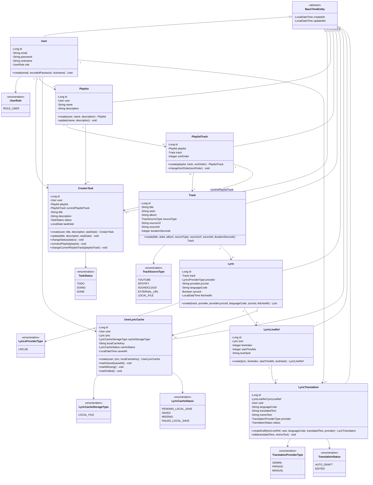

# KuroStep Class Diagram

## 문서 목적

이 문서는 KuroStep의 주요 JPA Entity, Enum, Repository 관계를 구현 전에 확인하기 위한 클래스 다이어그램 문서이다.

실제 구현 시 상세 컬럼 제약은 `KuroStep_Data_Dictionary.md`, 변수명은 `KuroStep_Naming_Guide.md`를 기준으로 한다.

## Entity Class Diagram

## Repository 목록

| Entity | Repository | 주요 메서드 |
|---|---|---|
| `User` | `UserRepository` | `findByEmail`, `existsByEmail` |
| `CreatorTask` | `CreatorTaskRepository` | `findByUserId`, `findByUserIdAndTaskDate` |
| `Playlist` | `PlaylistRepository` | `findByUserIdOrderByCreatedAtDesc` |
| `PlaylistTrack` | `PlaylistTrackRepository` | `findByPlaylistIdOrderBySortOrderAsc`, `existsByPlaylistIdAndTrackId` |
| `Track` | `TrackRepository` | `findByTitleContainingOrArtistContaining`, `findBySourceTypeAndSourceId` |
| `Lyric` | `LyricRepository` | `findByTrackId`, `findByTrackIdAndProvider` |
| `UserLyricCache` | `UserLyricCacheRepository` | `findByUserIdAndLyricId` |
| `LyricLineRef` | `LyricLineRefRepository` | `findByLyricIdOrderByLineIndexAsc` |
| `LyricTranslation` | `LyricTranslationRepository` | `findByLyricLineRefIdAndUserId`, `findByUserIdAndLyricLineRefIdAndLanguageCode` |

## 구현 순서

1. `BaseTimeEntity`
2. `User`, `UserRole`, `UserRepository`
3. `Track`, `TrackSourceType`, `TrackRepository`
4. `Playlist`, `PlaylistTrack`, Repository 2개
5. `CreatorTask`, `TaskStatus`, `CreatorTaskRepository`
6. `Lyric`, `LyricLineRef`, `UserLyricCache`, 관련 Enum과 Repository
7. `LyricTranslation`, 번역 관련 Enum과 Repository

## 구현 주의사항

- Entity 필드명은 Java camelCase로 작성한다.
- DB 컬럼명은 snake_case로 매핑한다.
- 양방향 연관관계는 초반에는 만들지 않는다. 단방향 ManyToOne 중심으로 시작한다.
- `@Setter`는 기본적으로 사용하지 않는다.
- 값 변경은 `update`, `changeStatus`, `connectPlaylist` 같은 도메인 메서드로 처리한다.
- 같은 사용자/라인/언어의 번역은 중복 생성하지 않고 수정 또는 upsert 방식으로 처리한다.
