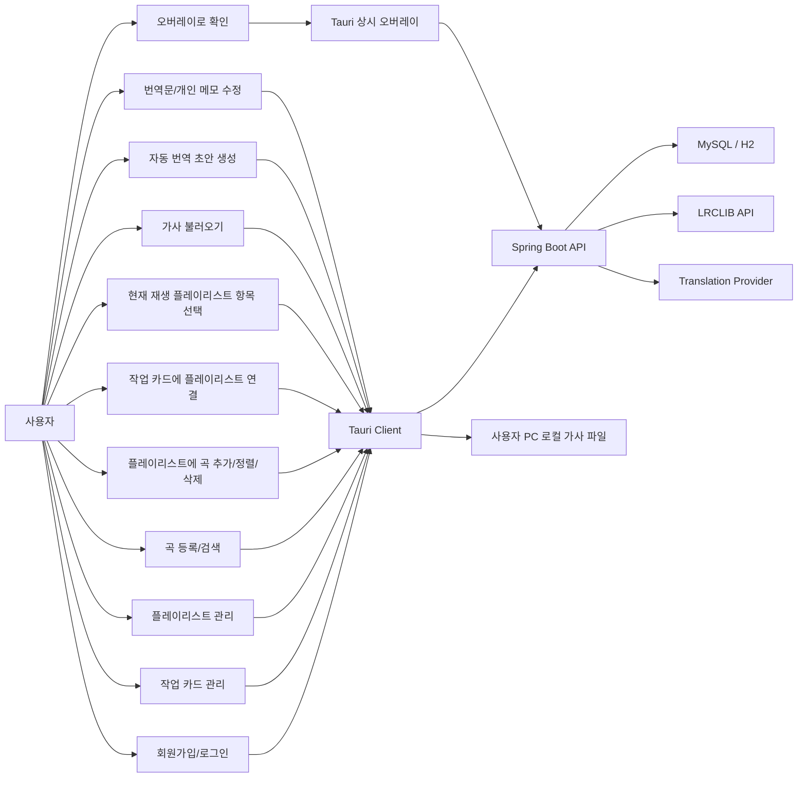
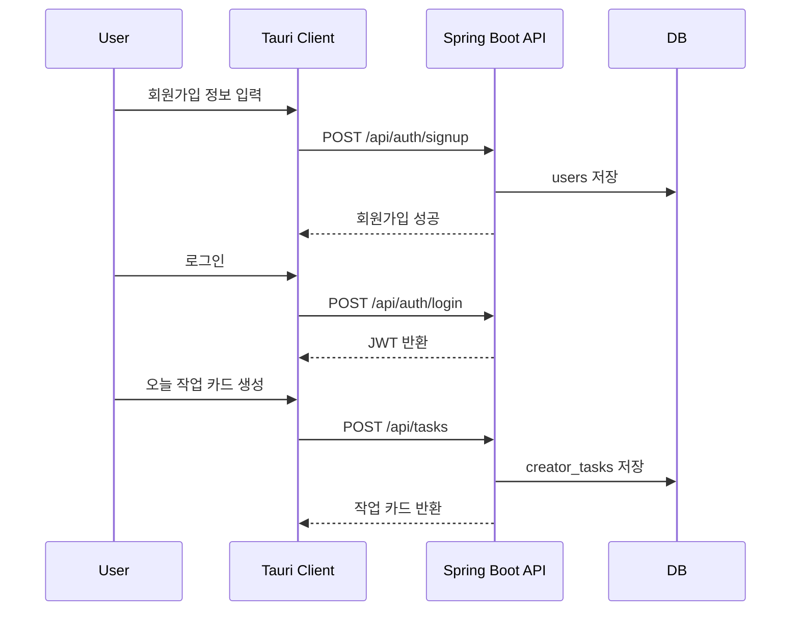
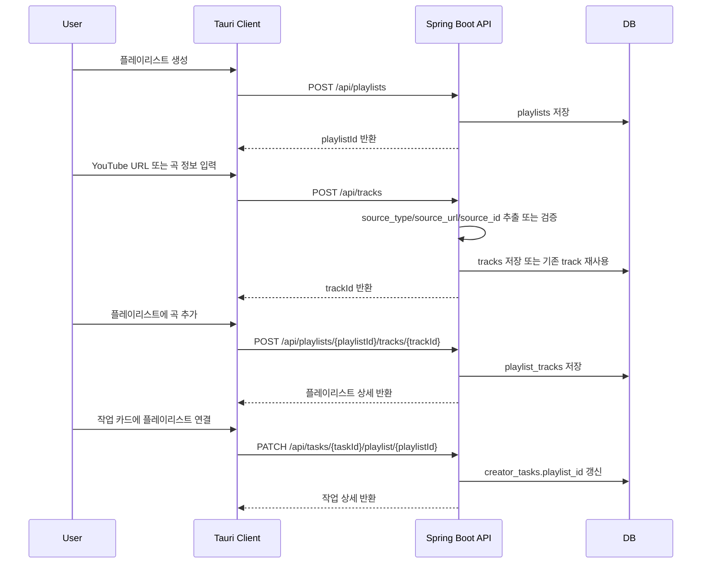
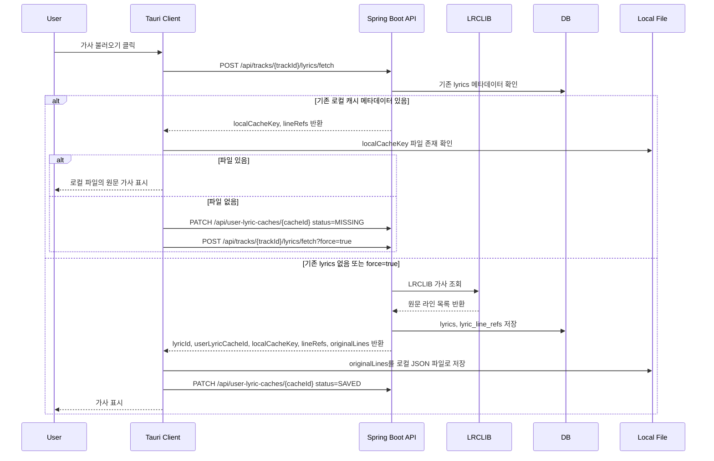
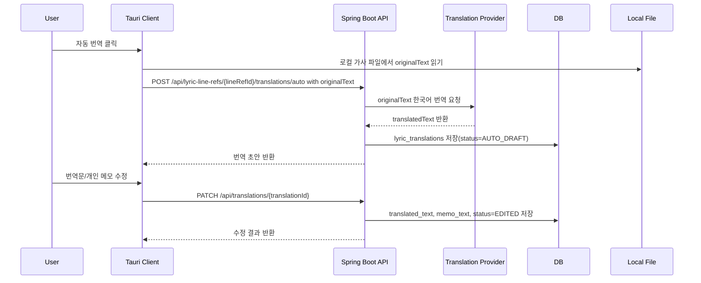
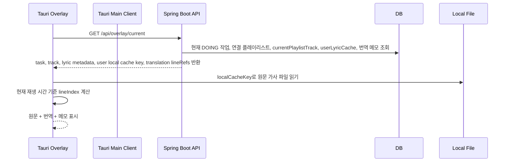
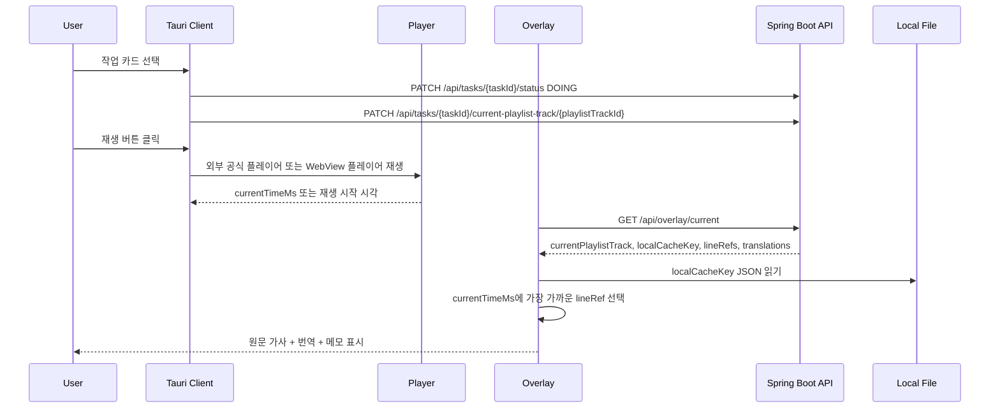
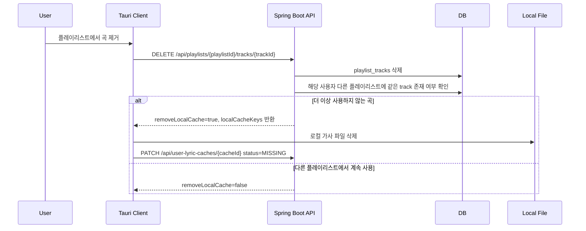

# KuroStep User Flow Review

## 문서 목적

이 문서는 KuroStep의 사용자 흐름을 기능별로 검토하기 위한 문서이다.

ERD와 API 명세만 보면 놓치기 쉬운 사용자 상호작용, 로컬 파일 저장 책임, 삭제 정책, 실패 상황을 확인한다.

## 1. 유스케이스 다이어그램

## 2. 핵심 사용자 흐름

### 2.1 첫 사용 흐름

검토 결과:

- 이 흐름은 현재 문서와 맞다.
- 추가로 필요한 상호작용은 없다.

### 2.2 플레이리스트와 곡 관리 흐름

검토 결과:

- 현재 문서에 플레이리스트 API를 추가했기 때문에 흐름은 성립한다.
- `tracks`는 사용자별 소유 테이블이 아니라 공용 곡 메타데이터로 볼 수 있다.
- 사용자가 직접 만든 곡 정보를 아무나 수정/삭제하면 안 되므로 `tracks`는 삭제 API를 MVP에서 만들지 않는 편이 안전하다.

보강 필요:

- `POST /api/tracks`는 같은 `source_type + source_id`가 있으면 새로 만들지 않고 기존 track을 반환하는 정책이 필요하다.
- `playlist_tracks`에는 같은 플레이리스트에 같은 곡이 중복 추가되지 않도록 UNIQUE 제약이 필요하다.

### 2.3 가사 불러오기와 로컬 파일 저장 흐름

검토 결과:

- 중요한 빈칸이 있었다.
- 백엔드는 사용자 PC에 직접 파일을 저장할 수 없다.
- 따라서 `lyrics/fetch` 응답에는 Tauri가 로컬 파일로 저장할 원문 라인 데이터가 포함되어야 한다.
- Tauri가 파일 저장에 성공한 뒤 `PATCH /api/user-lyric-caches/{cacheId}`로 저장 상태를 알려줘야 한다.

보강 필요:

- `LyricCacheStatus`에 `FAILED_LOCAL_SAVE`가 필요하다.
- 사용자별 로컬 파일 상태는 `lyrics`가 아니라 `user_lyric_caches`에서 관리해야 한다.
- `POST /api/tracks/{trackId}/lyrics/fetch` 응답 DTO에는 `originalLines`가 포함되어야 한다.
- `GET /api/tracks/{trackId}/lyrics`는 원문 텍스트가 아니라 `localCacheKey`, `lineRefs`, `cacheStatus`를 반환한다.
- Tauri는 `localCacheKey`로 로컬 JSON 파일을 읽어 원문을 표시한다.

### 2.4 자동 번역과 번역 메모 흐름

검토 결과:

- 또 하나의 중요한 빈칸이 있었다.
- 원문 가사를 서버 DB에 저장하지 않으므로, 서버가 자동 번역을 하려면 Tauri가 로컬 파일에서 읽은 `originalText`를 요청 본문에 담아 보내야 한다.
- `lyric_translations`에는 `memo_text`가 필요하다. 이미 데이터 딕셔너리에 추가했다.

보강 필요:

- 자동 번역 API 요청 DTO에 `originalText`가 필요하다.
- 번역 메모 수정 API에는 `translatedText`, `memoText` 둘 다 필요하다.
- 같은 사용자/라인/언어의 기존 번역이 있으면 새로 만들지 않고 update 또는 upsert 정책이 필요하다.

### 2.5 오버레이 표시 흐름

검토 결과:

- 오버레이는 서버 응답만으로 원문 가사를 표시할 수 없다.
- 오버레이도 Tauri 앱이므로 로컬 파일을 읽을 수 있어야 한다.
- 현재 라인 계산은 프론트에서 `startTimeMs`와 재생 위치 기준으로 처리하는 것이 자연스럽다.

보강 필요:

- `GET /api/overlay/current`는 원문 텍스트가 아니라 `localCacheKey`, `lineRefs`, `translations`를 반환해야 한다.
- Tauri는 재생 위치를 관리해야 한다.
- MVP에서는 실제 플레이어 위치 연동이 어려우면 Tauri 내부 타이머 또는 다음/이전 라인 버튼으로 처리할 수 있다.

### 2.5.1 재생과 싱크 흐름

검토 결과:

- 재생은 서버가 아니라 Tauri가 담당한다.
- 싱크 계산도 서버가 아니라 Tauri/오버레이가 담당한다.
- 백엔드는 현재 작업, 현재 곡, 라인 메타데이터, 번역 메모를 제공한다.
- YouTube iframe 등 플레이어에서 현재 시간을 읽을 수 있으면 그 값을 사용한다.
- 현재 시간 연동이 불안정하면 MVP에서는 Tauri 내부 타이머로 `currentTimeMs`를 계산한다.

### 2.6 플레이리스트에서 곡 제거 흐름

검토 결과:

- 이 흐름도 문서에 명시가 부족했다.
- 삭제의 기준은 “플레이리스트 하나에서 제거”가 아니라 “사용자의 모든 플레이리스트에서 더 이상 쓰지 않는가”여야 한다.
- 번역/메모는 사용자가 직접 삭제하지 않는 한 유지하는 것이 맞다.

보강 필요:

- 곡 제거 API 응답에 `removeLocalCache`, `localCacheKeys`가 필요하다.
- 로컬 파일 삭제는 Tauri가 수행한다.
- 서버는 로컬 파일 삭제 결과를 상태로만 기록한다.

## 3. 기능 누락 점검

| 영역 | 현재 상태 | 누락/위험 | 조치 |
|---|---|---|---|
| 회원/인증 | 명확함 | 없음 | 유지 |
| 작업 카드 | 명확함 | 현재 작업 선택 기준 필요 | `DOING` 작업 또는 사용자가 선택한 active task 기준 |
| 플레이리스트 | 방금 추가됨 | 삭제 시 로컬 캐시 처리 필요 | 곡 제거 응답에 삭제 대상 캐시 키 포함 |
| 곡 등록 | 명확해짐 | 중복 등록 정책 필요 | `source_type + source_id` 기준 find-or-create |
| 가사 조회 | 구조는 명확함 | 백엔드가 로컬 저장 못 함 | fetch 응답에 원문 라인 포함, Tauri 저장 후 상태 갱신 |
| 가사 보관 | 명확해짐 | 로컬 파일 없음 상태 처리 필요 | cacheStatus `MISSING`, `FAILED_LOCAL_SAVE` 추가 |
| 자동 번역 | 일부 빈칸 있음 | 서버에 원문이 없으므로 번역 요청에 원문 필요 | Tauri가 `originalText`를 보내는 API로 설계 |
| 번역 메모 | 보강됨 | 번역문과 메모 구분 필요 | `translated_text`, `memo_text` 분리 |
| 오버레이 | 구조는 가능 | 원문 표시 책임 위치 필요 | Tauri가 로컬 파일 읽고 서버 번역 메타데이터 결합 |
| 재생/싱크 | 보강됨 | 실제 플레이어 currentTime 연동 실패 가능 | WebView currentTime 우선, 실패 시 Tauri 내부 타이머 |
| Docker/EC2 | 명확함 | Tauri 로컬 파일은 배포 서버와 무관 | 발표에서 역할 분리 설명 |

## 4. 20명 페르소나 검토 요약

| 번호 | 페르소나 | 검토 의견 |
|---|---|---|
| 1 | 웹툰 작가 | 작업별 BGM 플레이리스트는 자연스럽다. 곡 하나 연결보다 낫다. |
| 2 | 웹툰 어시스턴트 | 오버레이에 현재 작업과 가사/번역이 같이 뜨면 작업 중 확인성이 좋다. |
| 3 | 일러스트레이터 | 번역문만이 아니라 개인 메모가 있어야 다시 볼 이유가 생긴다. |
| 4 | 프리랜서 창작자 | 플레이리스트 삭제 시 내 번역이 사라지면 싫다. 유지 정책이 맞다. |
| 5 | 야간 작업자 | 앱을 다시 켰을 때 이전 작업/플레이리스트가 남아 있어야 쓸 수 있다. |
| 6 | 음악 작업 루틴 사용자 | 가사를 매번 다시 불러오지 않는 로컬 캐시가 필요하다. |
| 7 | 외국어 가사 사용자 | 자동 번역 초안 후 직접 수정하는 흐름이 현실적이다. |
| 8 | 보안 관점 리뷰어 | 사용자별 작업/번역 권한 검증이 있어야 한다. |
| 9 | 백엔드 강사 관점 | 플레이리스트, 작업, 곡, 가사 참조, 번역의 JPA 관계가 포인트다. |
| 10 | 배포 관점 리뷰어 | 로컬 파일은 Tauri 책임이고 서버 배포와 분리된다는 설명이 필요하다. |
| 11 | 정책 민감 리뷰어 | 서버 DB에 가사 전문을 저장하지 않는 구조가 방어력이 있다. |
| 12 | 초보 개발자 | 기능이 많으므로 골든패스를 먼저 완성해야 한다. |
| 13 | API 설계 리뷰어 | 로컬 캐시 저장 성공/실패 API가 필요하다. |
| 14 | UX 리뷰어 | 현재 작업을 어떻게 선택하는지 명확해야 한다. |
| 15 | DB 설계 리뷰어 | `playlist_tracks`와 중복 방지 UNIQUE가 필요하다. |
| 16 | 번역 기능 사용자 | 메모와 번역문을 분리해야 한다. |
| 17 | 오버레이 사용자 | 실제 재생 시간 연동이 어렵다면 수동/타이머 방식 MVP도 가능하다. |
| 18 | 포폴 리뷰어 | 단순 CRUD보다 Provider, 로컬 캐시, 권한 검증이 차별점이다. |
| 19 | 구현 일정 리뷰어 | 5일에는 많다. 기능별 완성도 우선순위가 필요하다. |
| 20 | 발표 리뷰어 | “작업 맥락 관리”라는 한 문장으로 설명 가능해야 한다. |

## 5. 5일 백엔드 세미 규모 평가

작아 보이지 않는다. 오히려 기능 수만 보면 큰 편이다.

강점:

- Spring Security + JWT
- 사용자별 권한 검증
- 작업 카드 CRUD
- 플레이리스트와 곡 연결
- LRCLIB 외부 API 연동
- Tauri 로컬 파일 캐시
- 자동 번역/번역 메모
- 오버레이 API
- Swagger, Docker, EC2

위험:

- Tauri, LRCLIB, 번역 Provider, Docker/EC2를 모두 같은 완성도로 하려 하면 5일에 빡세다.
- 골든패스를 먼저 완성해야 한다.

권장 골든패스:

1. 회원가입/로그인
2. 작업 카드 생성
3. 플레이리스트 생성
4. 곡 등록
5. 플레이리스트에 곡 추가
6. 작업 카드에 플레이리스트 연결
7. LRCLIB 가사 조회
8. Tauri 로컬 파일 저장
9. 번역 초안/메모 저장
10. 오버레이에서 현재 작업/곡/가사/번역 표시

이 골든패스가 되면 프로젝트는 충분히 의미 있다.
