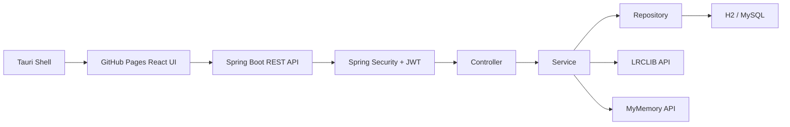
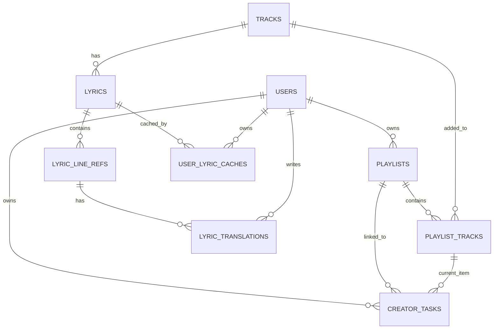

# KuroStep

> 창작자의 오늘 작업, 작업용 BGM, 가사 라인, 번역 메모를 하나의 작업 맥락으로 묶는 데스크톱 작업 보조 서비스

KuroStep은 재택으로 작업하는 웹툰 작가, 일러스트레이터, 프리랜서 창작자를 위한 개인 작업 보조 서비스입니다. 창작자는 작업 중 Todo, 자주 듣는 BGM, 가사 해석, 떠오른 메모를 각각 다른 곳에 흩어두기 쉽습니다. KuroStep은 이 흩어진 정보를 `작업 카드` 중심으로 다시 연결하는 데 집중했습니다.

단순 Todo 앱이나 음악 플레이어가 아니라, `오늘 할 작업 - 작업용 플레이리스트 - 현재 곡 - 가사 라인 - 번역 메모`를 하나의 흐름으로 다룹니다. 검은 고양이가 책상 옆에서 조용히 작업 발자국을 따라온다는 콘셉트로, 데스크톱 위젯 형태의 사용 경험을 목표로 했습니다.

## 프로젝트 정보

| 항목 | 내용 |
|---|---|
| 프로젝트 주제 | 창작자용 작업 카드 + BGM + 가사/번역 메모 관리 서비스 |
| 제작 기간 | 2026.06 |
| 참여 인원 | 1인 개발 |
| Backend | Spring Boot, Spring MVC, Spring Data JPA, Spring Security, JWT, BCrypt |
| Frontend/Desktop | React, TypeScript, Tauri |
| Database | H2, MySQL |
| DevOps | Docker Compose, Terraform, AWS EC2, GitHub Actions, GitHub Pages |
| 배포 UI | https://song991123.github.io/KuroStep/ |
| 데스크톱 릴리즈 | https://github.com/Song991123/KuroStep/releases/tag/v0.1.0 |

## 화면 미리보기

| 로그인 | 작업 발자국 |
|---|---|
|  |  |

현재 데스크톱 앱은 Tauri shell이 창 제어를 맡고, 내부 화면은 GitHub Pages에 배포된 React UI를 불러오는 하이브리드 구조입니다. 로그인 후 메인 BGM 턴테이블, 작업 발자국, 가사 오버레이 창을 함께 관리하는 방향으로 구성했습니다.

## 문제 정의

창작 작업 중에는 "무엇을 해야 하는지"와 "어떤 음악을 들으며 어떤 감정을 붙잡았는지"가 함께 남는 경우가 많습니다. 하지만 일반 Todo 앱은 작업만 관리하고, 음악 앱은 재생만 담당하며, 가사 번역이나 메모는 별도 문서에 흩어집니다.

KuroStep은 이 문제를 다음처럼 정의했습니다.

- 작업 카드와 BGM이 따로 관리되면 작업 맥락이 끊긴다.
- 가사나 번역 메모를 서버에 무작정 저장하면 저작권/정책 리스크가 커진다.
- 사용자가 여러 작업과 플레이리스트를 다룰 때, 본인 데이터만 안전하게 접근해야 한다.
- 데스크톱 작업 중에는 브라우저 탭보다 작고 고정된 위젯 경험이 더 자연스럽다.

## 핵심 판단

| 판단 | 이유 | 구현 |
|---|---|---|
| 작업 카드를 중심 모델로 둠 | Todo와 음악을 따로 두면 서비스 차별점이 약해짐 | `CreatorTask`가 `Playlist`, 현재 `PlaylistTrack`을 참조 |
| 사용자별 소유권 검증을 Service 계층에 둠 | JWT가 있어도 리소스 소유자 검증이 없으면 다른 사용자의 데이터 접근 가능 | Task, Playlist, Translation 처리 시 `userId` 검증 |
| 가사 전문을 서버 DB에 대량 저장하지 않음 | 가사 저작권과 외부 Provider 정책 리스크를 줄이기 위함 | 서버는 라인 참조/캐시 키/번역 메모 중심 저장 |
| YouTube 다운로드/광고 제거를 제외함 | 스트림 추출과 광고 우회는 정책 리스크가 큼 | 공식 플레이어 기반 재생 방향으로 제한 |
| Tauri는 앱 shell, React는 배포 UI로 분리 | UI를 GitHub Pages로 빠르게 갱신하면서 앱 창 제어는 Tauri가 담당 | Tauri shell이 GitHub Pages React UI를 iframe 로드 |
| Docker/EC2/Terraform까지 적용 | 로컬 실행으로 끝내지 않고 배포 가능한 백엔드 흐름을 검증 | EC2에서 Spring Boot + MySQL + Caddy 실행 |

## 주요 기능

| 영역 | 기능 |
|---|---|
| Auth/Security | 회원가입, 로그인, Spring Security, JWT, BCrypt |
| Task | 작업 카드 CRUD, 오늘 작업 조회, `TODO`/`DOING`/`DONE` 상태 변경 |
| Track/Playlist | YouTube URL 기반 곡 등록, 플레이리스트 CRUD, 곡 추가/삭제/순서 변경/셔플 |
| Work Context | 작업 카드에 플레이리스트 연결, 현재 재생 곡 항목 설정 |
| Lyrics | LRCLIB 기반 가사 조회, 가사 라인 참조 생성 |
| Translation Memo | 가사 라인별 한국어 번역 초안, 사용자 번역 메모 저장/삭제 |
| Client | React UI, Tauri 데스크톱 shell, 가사/작업 위젯 구조 |
| DevOps | Swagger, Docker Compose, GitHub Actions, Terraform, AWS EC2 |

## 기술 선택 이유

| 기술 | 선택 이유 |
|---|---|
| Spring Boot / Spring MVC | REST API, 계층형 구조, 세미 프로젝트에서 학습한 백엔드 핵심을 보여주기 적합 |
| Spring Data JPA | 작업-플레이리스트-곡-가사 라인이 연결되는 도메인을 연관관계로 표현하기 위함 |
| Spring Security + JWT | 데스크톱/웹 클라이언트가 API를 호출하는 구조에서 stateless 인증을 적용하기 위함 |
| BCrypt | 비밀번호 원문 저장을 피하고 안전한 단방향 해시를 적용하기 위함 |
| H2 / MySQL | H2로 테스트와 로컬 개발을 빠르게 하고, MySQL로 배포 환경을 구성 |
| React / TypeScript | Vanilla JS에서 커진 상태 관리와 재렌더 문제를 줄이고, 컴포넌트 단위로 UI를 안정화하기 위함 |
| Tauri | 작업 중 항상 띄워둘 수 있는 가벼운 데스크톱 위젯 경험을 만들기 위함 |
| Docker / EC2 / Terraform | 로컬 구현에서 끝내지 않고, 컨테이너 실행과 코드 기반 인프라 구성을 검증하기 위함 |

## 데모와 릴리즈

현재 데스크톱 릴리즈 버전은 `v0.1.0`입니다.

- GitHub Pages: React UI 자동 배포
- Backend CI: Spring Boot 테스트 자동 실행
- EC2 Deploy: 수동 실행 기반 API 서버 배포
- Desktop Release: GitHub Actions에서 macOS/Windows Tauri 번들 생성

데스크톱 릴리즈는 `.github/workflows/tauri-release.yml`에서 수동 실행하거나 `v*` 태그를 push하면 GitHub Releases에 공개 생성됩니다. macOS `.dmg`와 Windows 설치 파일은 Release assets에 첨부되는 구조입니다. macOS 빌드는 개인 포트폴리오 배포용 ad-hoc 서명 상태이며, Apple Developer ID 공증은 향후 정식 배포 단계에서 적용할 예정입니다.

로컬 macOS 환경에서는 React production build와 Tauri `.app` 번들 생성을 확인했습니다. Windows 설치 파일은 GitHub Actions의 Windows runner에서 생성하는 방식으로 분리했습니다.

다운로드:

- macOS: `KuroStep_0.1.0_aarch64.dmg`
- Windows: `KuroStep_0.1.0_x64-setup.exe`

macOS 빌드는 개인 포트폴리오 배포용 ad-hoc 서명 상태입니다. Apple Developer ID 공증을 하지 않았기 때문에 처음 실행 시 Gatekeeper 경고가 발생할 수 있습니다.

## 시스템 구조



## 데이터 모델



## 검증한 흐름

통합 테스트와 HTTP 요청으로 아래 백엔드 흐름을 확인했습니다.

```text
회원가입
-> 로그인
-> JWT 발급
-> 곡 등록
-> 플레이리스트 생성
-> 플레이리스트에 곡 추가
-> 작업 카드 생성
-> 작업 카드에 플레이리스트 연결
-> 현재 재생 곡 설정
-> 작업 상태 변경
-> LRCLIB 가사 조회
-> 가사 라인 참조 생성
-> MyMemory 번역 초안 생성
```

React UI에서는 다음 흐름을 회귀 테스트했습니다.

- 회원가입/로그인
- 할 일 추가
- 단일 YouTube 링크 추가
- 두 번째 YouTube 링크 추가 시 현재 곡 유지
- 공개 YouTube playlist 미리보기와 일부 담기
- 트랙 선택/삭제
- 가사 조회
- 전체 가사 줄 선택
- 현재 줄 저장과 번역 메모 저장 시도

## 가사 저장 정책

KuroStep은 가사 전문을 서버 DB에 계속 수집하는 구조를 피하고, 서버에는 연결에 필요한 메타데이터와 사용자 메모를 중심으로 저장합니다.

- 첫 재생 시: LRCLIB에서 가사를 조회하고 번역 초안을 준비합니다.
- 이후 재생 시: 클라이언트 로컬 캐시를 우선 사용합니다.
- 재생 중: 다음 곡의 가사와 번역 초안을 백그라운드에서 준비하는 방향으로 설계했습니다.
- 서버 DB: 가사 묶음, 라인 번호, 시작 시간, 로컬 캐시 키, 사용자별 번역 메모를 저장합니다.

이 판단은 외부 API 호출로 인한 재생 지연을 줄이고, 서버가 가사 전문을 대량 보관하지 않도록 하기 위한 설계입니다.

## 프로젝트 구조

```text
.
├── KuroStep/                 # Spring Boot 백엔드
├── kurostep-tauri-widget/    # React UI + Tauri shell
├── infra/                    # Terraform EC2 인프라 코드
└── docs/                     # 공개 보고 문서
```

## 설치와 실행 방법

### Desktop App

GitHub Releases에서 운영체제에 맞는 설치 파일을 내려받아 실행합니다.

- macOS: `.dmg` 파일을 열고 `KuroStep.app`을 실행합니다.
- Windows: `x64-setup.exe` 또는 `.msi` 설치 파일을 실행합니다.

개발 환경에서는 아래 명령으로 Tauri 앱을 실행할 수 있습니다.

```bash
cd kurostep-tauri-widget
npm install
npm run tauri:dev
```

### Backend

```bash
cd KuroStep
./gradlew bootRun
```

Swagger UI:

```text
http://localhost:8080/swagger-ui/index.html
```

### React UI

```bash
cd kurostep-tauri-widget
npm install
npm run dev:react
```

### Tauri App

```bash
cd kurostep-tauri-widget
npm run tauri:dev
```

GitHub Pages:

```text
https://song991123.github.io/KuroStep/
```

## 테스트

```bash
cd KuroStep
./gradlew test
```

테스트 구성:

- `AuthServiceTest`
- `TrackServiceTest`
- `KuroStepFlowIntegrationTest`

## 배포와 운영 검증

- GitHub Pages로 React UI 배포
- GitHub Actions로 백엔드 테스트 자동화
- GitHub Actions로 macOS/Windows Tauri 데스크톱 번들 생성
- Docker Compose로 Spring Boot + MySQL 실행 환경 구성
- Terraform으로 EC2, 보안그룹, Elastic IP 구성
- EC2에서 Spring Boot API, MySQL, Caddy 컨테이너 실행 확인
- Swagger UI, OpenAPI JSON, 회원가입/로그인 API 응답 확인

운영 환경의 DB 비밀번호, JWT secret, SSH key, Terraform state는 Git에 커밋하지 않고 환경변수 또는 GitHub Secrets로 관리합니다.

## 핵심 코드 포인트

| 코드 영역 | 설명 |
|---|---|
| `KuroStep/src/main/java/com/kurostep/security` | Spring Security, JWT 인증 필터, 인증 사용자 처리 |
| `KuroStep/src/main/java/com/kurostep/auth` | 회원가입, 로그인, BCrypt 비밀번호 암호화 |
| `KuroStep/src/main/java/com/kurostep/task` | 작업 카드 CRUD, 상태 변경, 플레이리스트 연결 |
| `KuroStep/src/main/java/com/kurostep/playlist` | 플레이리스트 생성, 트랙 추가/삭제/순서 관리 |
| `KuroStep/src/main/java/com/kurostep/lyrics` | LRCLIB 가사 조회, 라인 참조, 번역 메모 흐름 |
| `kurostep-tauri-widget/src` | React/TypeScript 기반 데스크톱 위젯 UI |
| `kurostep-tauri-widget/src-tauri` | Tauri shell, 창 제어, 앱 번들 설정 |

## 트러블슈팅

| 문제 | 원인 | 대응 |
|---|---|---|
| Spring Security 적용 후 API 401 발생 | 인증 제외 경로와 JWT 필터 순서가 정리되지 않음 | Security 설정과 JWT 필터 순서 조정 |
| 사용자별 데이터 접근 위험 | JWT 인증만으로는 리소스 소유자 검증이 부족함 | Service 계층에서 `userId` 기반 소유권 검증 |
| YouTube iframe `Error 153` | Tauri WebView origin과 YouTube iframe 정책 충돌 | HTTPS GitHub Pages UI를 Tauri shell에서 로드하는 구조로 조정 |
| YouTube 광고/음원 정책 리스크 | 다운로드, 스트림 추출, 광고 제거는 정책 위반 소지가 큼 | 공식 플레이어 기반 재생으로 제한하고 우회 기능 제외 |
| GitHub Pages와 EC2 API 연결 | HTTPS 페이지에서 HTTP API 호출 시 Mixed Content 문제 발생 | Caddy/sslip.io 기반 HTTPS API 구성 |
| EC2 인스턴스 사양 문제 | `t3.micro`에서 Spring Boot + MySQL 동시 실행이 불안정 | `t3.small`로 조정 |
| Terraform 보안 | tfstate, tfvars, SSH key는 민감정보 포함 가능 | `.gitignore`로 Git 추적 제외 |

## 남은 개선점

- React UI와 Tauri 앱의 장시간 재생 안정성 검증
- refresh token, 이메일 인증, OAuth 같은 인증 고도화
- 외부 API 실패 시 사용자 경험 보강
- 가사 로컬 캐시를 Tauri 앱 데이터 디렉터리 기반으로 더 명확히 분리
- 플레이리스트와 가사 처리 흐름에 대한 추가 테스트 보강

## FAQ

### 왜 단순 Todo 앱이 아니라 BGM과 가사를 연결했나요?

창작 작업에서는 작업 내용뿐 아니라 그때 들은 음악과 가사에서 얻은 감정도 작업 맥락이 됩니다. KuroStep은 이 흐름을 작업 카드 기준으로 묶는 데 집중했습니다.

### 왜 YouTube 음원을 직접 추출하지 않나요?

다운로드, 스트림 추출, 광고 우회는 정책 리스크가 큽니다. 그래서 공식 플레이어 기반 재생과 사용자가 직접 등록한 작업 맥락 관리에 초점을 맞췄습니다.

### 왜 가사 전문을 서버 DB에 대량 저장하지 않나요?

가사는 저작권과 외부 Provider 정책을 고려해야 하는 데이터입니다. 서버는 라인 참조, 캐시 키, 사용자 번역 메모 중심으로 저장하고, 클라이언트 로컬 캐시를 함께 사용하는 방향으로 설계했습니다.

### macOS에서 경고가 뜨는 이유는 무엇인가요?

현재 릴리즈는 포트폴리오용 ad-hoc 서명 빌드입니다. Apple Developer ID 공증을 적용하지 않았기 때문에 macOS Gatekeeper 경고가 발생할 수 있으며, 정식 배포 단계에서는 개발자 인증서와 notarization을 적용할 예정입니다.

## 라이선스

현재 저장소는 포트폴리오 공개 목적의 개인 프로젝트입니다. 외부 배포나 재사용 라이선스는 별도로 지정하지 않았습니다.

## 문서

- [최종 보고서](docs/report/final-report.md)
