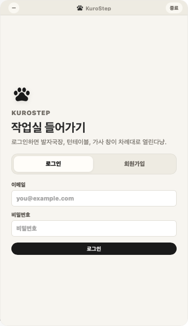
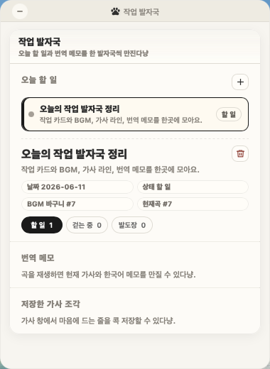
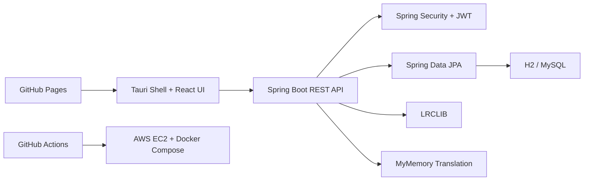

# KuroStep

> 오늘 할 일과 작업용 BGM, 가사, 번역 메모를 한 작업 흐름으로 묶는 창작자용 데스크톱 위젯

KuroStep은 재택 창작자가 작업하면서 따로 관리하던 `Todo`, `작업용 플레이리스트`, `가사`, `번역 메모`를 작업 카드 하나에 연결해 주는 Spring Boot 기반 백엔드 + Tauri 위젯 프로젝트입니다.


## 🐾 프로젝트 한눈에 보기

| 항목 | 내용 |
|---|---|
| 개발 기간 | 2026.06 |
| 개발 형태 | 1인 개인 프로젝트 |
| 프로젝트 성격 | Spring Boot 백엔드 세미 프로젝트 + 데스크톱 위젯 PoC |
| 핵심 목표 | 작업 카드, BGM, 가사, 번역 메모를 한 흐름에서 관리 |
| 주요 검증 | 회원가입/로그인, JWT 인증, 작업 카드 CRUD, 플레이리스트/곡 관리, 가사 조회, 번역 메모 저장, Tauri 위젯 실행 |

| 구분 | 링크 |
|---|---|
| 배포 UI | [GitHub Pages](https://song991123.github.io/KuroStep/) |
| 데스크톱 릴리즈 | [GitHub Releases](https://github.com/Song991123/KuroStep/releases/tag/v0.1.5) |
| 상세 문서 | [docs](docs/README.md) |
| 최종 보고서 | [docs/report/kurostep_v1_report.md](docs/report/kurostep_v1_report.md) |

## 💡 왜 만들었나

창작 작업을 하다 보면 오늘 해야 할 일, 작업할 때 듣는 음악, 마음에 걸린 가사, 직접 적어 둔 번역 메모가 함께 남습니다. 그런데 일반 Todo 앱은 작업만 관리하고, 음악 서비스는 재생만 담당합니다. 가사 해석이나 메모는 결국 다른 문서에 흩어지기 쉽습니다.

KuroStep은 이 문제를 이렇게 잡았습니다.

> 오늘의 작업 카드 안에서 할 일, BGM 바구니, 현재 가사, 번역 메모가 끊기지 않고 이어져야 한다.

## ✨ 핵심 기능

| 영역 | 구현 내용 |
|---|---|
| 인증/인가 | 회원가입, 로그인, BCrypt 비밀번호 암호화, JWT 인증 |
| 작업 카드 | 오늘 작업 카드 CRUD, `TODO` / `DOING` / `DONE` 상태 변경 |
| BGM 바구니 | YouTube 링크 기반 곡 등록, 플레이리스트 추가/삭제/순서 변경/셔플 |
| 작업 맥락 연결 | 작업 카드와 플레이리스트 연결, 현재 작업 곡 지정 |
| 가사 조회 | LRCLIB 기반 가사 조회, 가사 줄 단위 관리, 로컬 캐시 우선 사용 |
| 번역 메모 | 가사 줄별 번역 초안과 사용자 메모 저장/삭제 |
| 데스크톱 위젯 | Tauri shell, React 위젯, 작업 발자국 창, 가사 오버레이 창 |
| 배포/운영 | GitHub Actions, Docker Compose, Terraform, AWS EC2 배포 구성 |

## 🖼️ 화면 미리보기

| 로그인 | 작업 발자국 |
|---|---|
|  |  |

## 🏗️ 시스템 구조



## 🛠️ 기술 스택과 선택 이유

| 구분 | 기술 |
|---|---|
| Backend | Java 21, Spring Boot 4.0.6, Spring MVC, Spring Data JPA |
| Security | Spring Security, JWT, BCrypt |
| Database | H2, MySQL 8.4 |
| Frontend/Desktop | React, TypeScript, Tauri |
| DevOps | Docker Compose, GitHub Actions, Terraform, AWS EC2 |

## 🎯 주요 설계 판단

| 판단 | 이유 |
|---|---|
| 작업 카드 중심 모델 | Todo, BGM, 가사 메모가 따로 흩어지지 않도록 `CreatorTask`를 중심에 둠 |
| Service 계층 소유권 검증 | JWT 인증 후에도 다른 사용자의 작업/플레이리스트에 접근하지 못하도록 서비스에서 한 번 더 검증 |
| 가사 전문 서버 저장 최소화 | 가사 저작권과 Provider 정책 리스크를 줄이기 위해 가사 줄 참조, 캐시 키, 사용자 메모 중심으로 저장 |
| React + Tauri 구조 | Vanilla JS에서 커진 상태 관리 부담을 줄이고, 데스크톱 위젯 창 제어는 Tauri가 맡도록 분리 |
| Docker/EC2/Terraform 적용 | 로컬 실행에서 끝내지 않고, 배포 가능한 백엔드 운영 흐름까지 확인 |

## ✅ 검증한 사용자 흐름

```text
회원가입 -> 로그인 -> JWT 발급
-> 작업 카드 생성/상태 변경
-> YouTube 곡 등록
-> 플레이리스트에 곡 추가/삭제/순서 변경
-> 작업 카드에 플레이리스트와 현재 곡 연결
-> LRCLIB 가사 조회
-> 가사 라인 선택
-> 번역 메모 저장
```

가사 조회는 LRCLIB 등록 여부와 곡 제목/아티스트 정규화 결과에 영향을 받습니다. 2026-06-16 기준 샘플 검증에서는 공식 MV나 Topic 음원처럼 제목과 아티스트가 명확한 곡에서 synced lyrics 조회를 확인했습니다. 자세한 검증 범위와 한계는 [가사 조회 검증](docs/lyrics-verification.md)에 정리했습니다.

## 📚 상세 문서

| 문서 | 내용 |
|---|---|
| [프로젝트 개요](docs/project-overview.md) | 문제 정의, 사용자 흐름, MVP 범위 |
| [기능 명세](docs/features.md) | 핵심 기능과 구현 상태 |
| [시스템 아키텍처](docs/architecture.md) | 시스템 구조, 데이터 흐름, ERD |
| [가사 조회 검증](docs/lyrics-verification.md) | LRCLIB 검증 범위와 한계 |
| [트러블슈팅](docs/troubleshooting.md) | 개발 중 주요 문제와 해결 |
| [릴리즈 안내](docs/release.md) | 실행 방법, 배포, macOS Gatekeeper 안내 |
| [최종 보고서](docs/report/kurostep_v1_report.md) | 강사 제출용 최종 보고서 |

## 🚀 로컬 실행

### 백엔드

```bash
cd KuroStep
./gradlew bootRun
```

Swagger UI:

```text
http://localhost:8080/swagger-ui/index.html
```

### React UI

```bash
cd kurostep-tauri-widget
npm install
npm run dev:react
```

### Tauri 앱

```bash
cd kurostep-tauri-widget
npm run tauri:dev
```

## 🧩 회고

이번 프로젝트에서 가장 크게 배운 점은 기능을 많이 넣는 것보다 사용자 흐름이 끊기지 않게 데이터와 상태를 연결하는 일이 더 중요하다는 점이었습니다. 음악 재생, 가사 조회, 번역 메모, 작업 카드가 동시에 움직이면서 프론트 상태 관리와 비동기 처리의 복잡도가 빠르게 커졌고, 이를 React 컴포넌트 분리와 캐시/요청 중복 방지 구조로 정리했습니다.

향후에는 React UI를 더 세분화하고, Provider 실패 시 대체 가사 검색 전략과 테스트 커버리지를 확장할 계획입니다.
