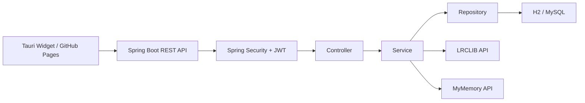
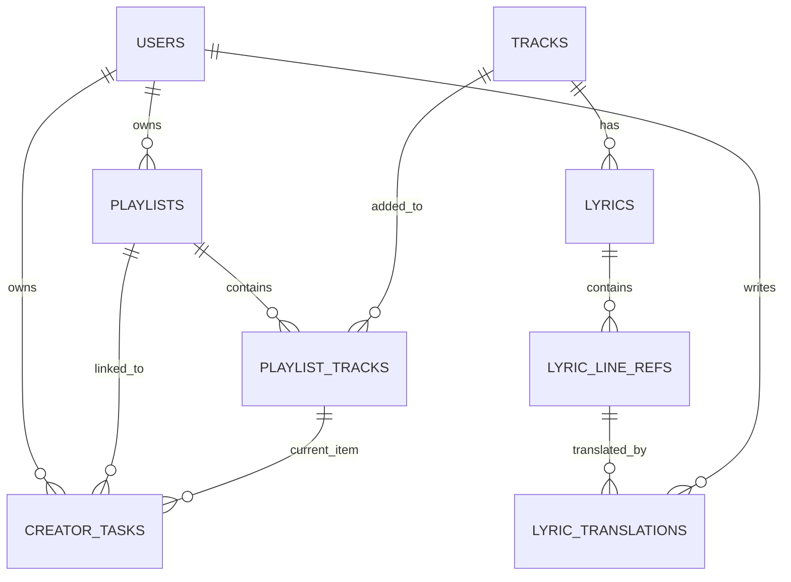

# KuroStep

> 창작자의 오늘 작업, 작업용 BGM, 가사, 번역 메모를 하나의 작업 맥락으로 연결하는 데스크톱 작업 보조 서비스

KuroStep은 재택으로 작업하는 웹툰 작가, 일러스트레이터, 프리랜서 창작자를 위한 개인 작업 보조 서비스입니다. 단순 Todo 앱이나 음악 플레이어가 아니라, `작업 카드 - 작업용 곡 - 플레이리스트 - 가사 라인 - 번역 메모`를 하나의 작업 흐름으로 묶는 것을 목표로 했습니다.

검은 고양이가 책상 옆에서 조용히 작업 발자국을 따라온다는 콘셉트로, 백엔드는 Spring Boot REST API로 구현하고 프론트는 Tauri 기반 데스크톱 위젯 형태로 구성했습니다.

## 프로젝트 개요

| 항목 | 내용 |
|---|---|
| 프로젝트명 | KuroStep |
| 개발 형태 | 개인 프로젝트 |
| 주제 | 창작자용 작업 카드 + BGM + 가사/번역 메모 관리 서비스 |
| Backend | Spring Boot REST API |
| Frontend | Tauri 데스크톱 위젯 / GitHub Pages 정적 배포 |
| Database | H2, MySQL |
| 배포/운영 | Docker, GitHub Actions, Terraform, AWS EC2 |

## 핵심 기능

- 이메일 기반 회원가입 / 로그인
- Spring Security + JWT 인증
- BCrypt 비밀번호 암호화
- 사용자별 작업 카드 CRUD
- 작업 상태 변경: `TODO`, `DOING`, `DONE`
- 곡 등록 및 검색
- YouTube URL 기반 곡 정보 관리
- YouTube playlist URL preview
- 플레이리스트 생성, 수정, 삭제
- 플레이리스트에 곡 추가 및 제거
- 작업 카드와 플레이리스트 연결
- 현재 작업 중인 플레이리스트 곡 설정
- LRCLIB 기반 가사 조회
- 가사 라인 참조 생성 및 조회
- MyMemory 기반 한국어 번역 초안 생성
- 라인별 번역 메모 저장 및 조회
- Tauri 위젯에서 작업, 플레이어, 가사 영역 분리 표시
- Swagger/OpenAPI 문서화
- Docker 기반 실행 환경 구성
- Terraform 기반 EC2 인프라 구성

## 기술 스택

### Backend

- Java 21
- Spring Boot 4
- Spring MVC
- Spring Data JPA
- Bean Validation
- Lombok

### Security

- Spring Security
- JWT
- BCrypt
- CORS 설정

### Database

- H2 Database
- MySQL
- JPA Entity Relationship
- Lazy Loading

### Frontend / Client

- Tauri
- Vanilla JavaScript
- HTML / CSS
- GitHub Pages

### DevOps

- Gradle
- Docker / Docker Compose
- Terraform
- GitHub Actions
- AWS EC2

## 시스템 구조



## 주요 데이터 모델



## 검증한 백엔드 흐름

통합 테스트와 HTTP 요청으로 아래 흐름을 검증했습니다.

```text
회원가입
-> 로그인
-> JWT 발급
-> 곡 등록
-> 플레이리스트 생성
-> 플레이리스트에 곡 추가
-> 작업 카드 생성
-> 작업 카드에 플레이리스트 연결
-> 현재 재생 곡 설정
-> 작업 상태 변경
-> LRCLIB 가사 조회
-> 가사 라인 참조 생성
-> MyMemory 번역 초안 생성
```

검증 로그 예시:

```text
track 1 https://www.youtube.com/watch?v=dQw4w9WgXcQ
lyric 1 lines 58 hasSourceText true
draft 1 MYMEMORY AUTO_DRAFT 절대 포기하지 않을 거예요
```

## 프로젝트 구조

```text
.
├── KuroStep/                 # Spring Boot 백엔드
├── kurostep-tauri-widget/    # Tauri 위젯 프론트엔드
├── infra/                    # Terraform EC2 인프라 코드
└── docs/                     # 보고서, 설계서, WBS 문서
```

## 실행 방법

### Backend

```bash
cd KuroStep
./gradlew bootRun
```

Swagger UI:

```text
http://localhost:8080/swagger-ui/index.html
```

### Frontend / Tauri Widget

```bash
cd kurostep-tauri-widget
npm install
npm run dev
```

GitHub Pages:

```text
https://song991123.github.io/KuroStep/
```

## 테스트

```bash
cd KuroStep
./gradlew test
```

테스트 구성:

- `AuthServiceTest`
- `TrackServiceTest`
- `KuroStepFlowIntegrationTest`

## 배포 구성

- GitHub Pages로 Tauri 위젯 정적 화면 배포
- GitHub Actions로 백엔드 테스트 자동화
- Dockerfile / Docker Compose로 Spring Boot + MySQL 실행 환경 구성
- Terraform으로 EC2, 보안그룹, Elastic IP 구성

운영 환경의 DB 비밀번호, JWT secret, SSH key, Terraform state는 Git에 커밋하지 않고 환경변수 또는 GitHub Secrets로 관리합니다.

## 트러블슈팅

| 문제 | 정리 |
|---|---|
| Spring Security 적용 후 API 401 발생 | 인증 제외 경로와 JWT 필터 순서 정리 |
| 사용자별 데이터 접근 제어 | Service 계층에서 리소스 소유자 검증 |
| YouTube iframe `Error 153` | Tauri WebView origin 문제로 HTTPS 기반 프론트 로딩 대안 검토 |
| YouTube 광고/음원 정책 | 다운로드, 스트림 추출, 광고 제거 기능 제외 |
| GitHub Pages와 EC2 HTTP API 연결 | Mixed Content 문제 때문에 HTTPS API 설정 필요 |
| Terraform 보안 | `.tfstate`, `.tfvars`, SSH key, `.env` 파일 Git 추적 제외 |

## 문서

- [최종 보고서](docs/report/final-report.md)
- [프로젝트 기획서](docs/design/project-plan.md)
- [데이터 딕셔너리](docs/design/data-dictionary.md)
- [클래스 다이어그램](docs/design/class-diagram.md)
- [정규화 검토](docs/design/normalization-review.md)
- [진행 WBS](docs/project-management/progress-todo.md)

## 회고

이번 프로젝트에서는 Spring Boot 계층형 구조, JPA 연관관계, Spring Security + JWT, 외부 API Provider 분리, Docker/EC2 배포 준비 과정을 한 흐름으로 경험했습니다. 특히 작업 카드와 음악/가사/번역 메모를 연결하는 도메인 모델을 설계하면서 단순 CRUD를 넘어 사용자별 작업 맥락을 어떻게 데이터로 표현할지 고민했습니다.

향후에는 HTTPS 배포, OAuth2 로그인, 이메일 인증, Provider fallback, WebSocket 기반 오버레이 동기화, 작업 시간 통계 기능을 확장할 계획입니다.
