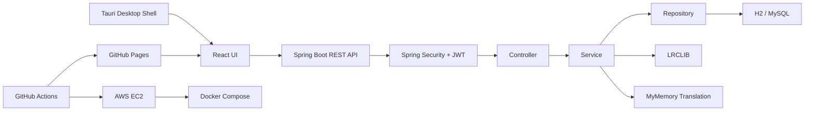
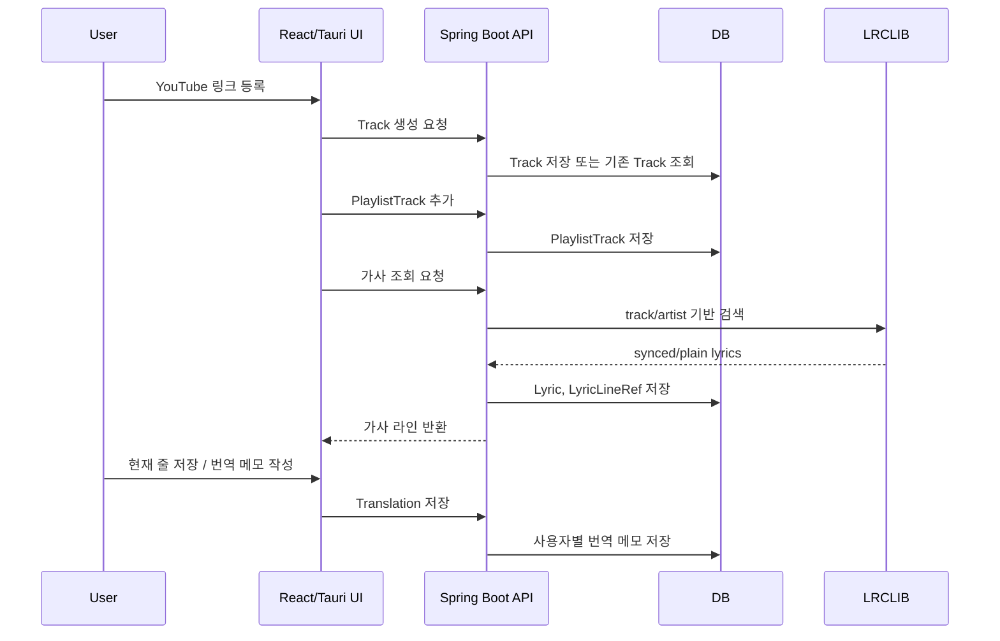
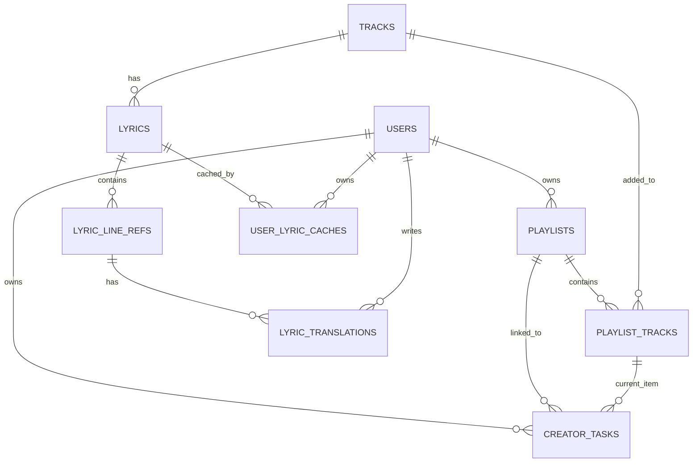

# 시스템 아키텍처

## 🏗️ 시스템 구성



## 🔄 요청 흐름



## 📂 주요 패키지 구조

```text
KuroStep/src/main/java/com/kurostep
├── auth          # 회원가입, 로그인
├── security      # Spring Security, JWT
├── user          # 사용자 도메인
├── task          # 작업 카드
├── track         # 곡
├── playlist      # 플레이리스트와 곡 연결
├── lyric         # 가사 Provider, 가사 라인 참조
├── translation   # 번역 초안, 사용자 메모
└── common        # 공통 예외, 공통 설정, BaseTimeEntity
```

```text
kurostep-tauri-widget
├── src-react     # React TypeScript UI
├── src           # Tauri shell HTML
├── src-tauri     # Tauri Rust commands/window control
└── docs          # UI migration notes
```

## 🗄️ ERD



## 🎯 데이터 설계 포인트

| 설계 | 이유 |
|---|---|
| `PlaylistTrack` 중간 테이블 | 플레이리스트별 곡 순서와 중복 제어를 관리하기 위해 분리 |
| `CreatorTask.currentPlaylistTrack` | 오늘 작업에서 현재 듣는 곡을 명시적으로 저장 |
| `LyricLineRef` | 가사 원문 전체보다 라인 인덱스/시작 시간/해시 기반 참조 중심으로 관리 |
| `LyricTranslation` | 사용자별 번역 메모를 같은 가사 라인에 별도로 저장 |
| `UserLyricCache` | 사용자 로컬 캐시 상태를 추적하기 위한 구조 |

## 🔐 보안 흐름

```text
로그인 성공
-> JWT 발급
-> React/Tauri 클라이언트 localStorage에 세션 저장
-> API 요청 시 Authorization 헤더 포함
-> JwtAuthenticationFilter에서 토큰 검증
-> Service 계층에서 userId 기반 소유권 확인
```
