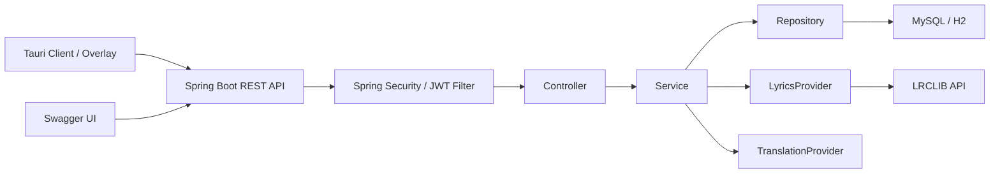
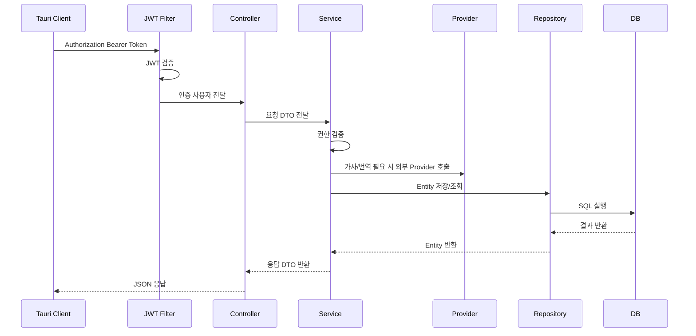
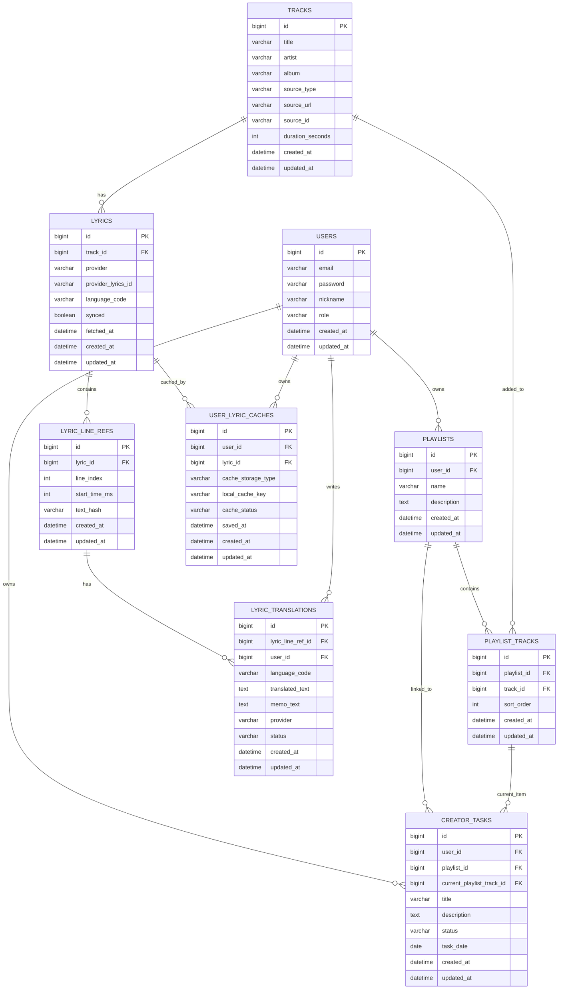

# KuroStep Personal Project

## 1. 프로젝트 개요

### 프로젝트 소개

**KuroStep**은 재택으로 작업하는 웹툰 작가, 일러스트레이터, 프리랜서 창작자가 오늘 할 작업을 등록하고, 해당 작업에 자주 듣는 BGM, 가사 라인, 한국어 번역 메모를 연결해 관리하는 작업 보조 서비스이다.

단순 Todo 앱이나 음악 앱이 아니라 `작업 카드 - 작업용 곡 - 가사 라인 - 번역 메모`를 하나의 작업 맥락으로 묶는 것이 핵심이다. 화면은 Tauri 기반 데스크탑 클라이언트와 상시 오버레이로 표현하고, 백엔드는 Spring Boot REST API, Spring Security, JWT, JPA, MySQL 기반으로 구현한다.

### 프로젝트 목표

- 재택 창작자의 오늘 작업을 작업 카드 단위로 관리한다.
- 사용자가 작업용 플레이리스트를 만들고, 작업 카드에 플레이리스트를 연결할 수 있게 한다.
- 작업용 플레이리스트에 BGM 재생 링크를 담아 관리한다.
- LRCLIB Provider로 가사 라인을 자동 조회한다.
- 한국어 자동 번역 초안을 생성하고 사용자가 직접 수정해 저장할 수 있게 한다.
- 가사 원문은 서버에 전문 DB로 쌓지 않고, 클라이언트 로컬 캐시로 보관하는 방향을 적용한다. 서버 DB에는 로컬 캐시 키, 라인 메타데이터, 사용자 번역 메모를 저장한다.
- 번역문과 개인 메모는 사용자별 서버 DB 데이터로 저장하고, API 응답으로 Tauri 클라이언트와 오버레이에 제공한다.
- Tauri 상시 오버레이에서 현재 작업, 곡, 가사/번역 라인을 표시한다.
- Spring Security와 JWT로 사용자별 작업, 곡, 번역 메모 접근 권한을 분리한다.
- Docker와 AWS EC2를 사용해 배포까지 확인한다.

### 현재 백엔드 구현 완료 범위

2026-06-10 기준으로 이번 세미 프로젝트에서 보고 가능한 Spring Boot 백엔드와 데스크톱 위젯 범위는 아래와 같다.

- 공통 예외 처리
- JWT 기반 회원가입, 로그인, 인증 흐름
- Spring Security 기반 `/api/**` 보호
- BCrypt 기반 비밀번호 암호화와 로그인 검증
- Swagger/OpenAPI 의존성 추가 및 API 문서 접근
- 곡 등록, 검색, 상세 조회
- Track 등록 시 YouTube `sourceUrl`, `sourceId` 저장
- 플레이리스트 생성, 조회, 수정, 삭제
- 플레이리스트에 곡 추가, 곡 목록 조회, 곡 제거, 순서 변경
- 작업 카드 생성, 조회, 수정, 삭제
- 오늘/날짜별 작업 조회
- 작업 상태 변경: `TODO`, `DOING`, `DONE`
- 작업 카드에 플레이리스트 연결
- 작업 카드의 현재 플레이리스트 곡 설정
- 가사 라인 참조 생성 및 조회
- LRCLIB 실제 외부 API 호출
- YouTube 링크가 포함된 Track의 `title`, `artist` 기반 가사 조회
- 조회된 가사 기반 lyric line reference 58개 생성
- 라인별 한국어 번역 메모 저장 및 조회
- MyMemory 실제 외부 API 호출
- 번역 초안 자동 생성
- H2 테스트 DB 기반 핵심 플로우 통합 테스트
- 실제 HTTP 요청 기반 MVP 흐름 검증
- Tauri shell 기반 메인 위젯, 작업/가사 메모 위젯, 가사 오버레이 분리
- GitHub Pages에 배포된 위젯 UI를 Tauri 앱 shell 안에서 로드하는 하이브리드 구조
- YouTube IFrame Player API 기반 재생, 정지, 이전/다음 곡, 반복, 셔플, 볼륨, 진행바 이동
- 플레이리스트 곡 제거 버튼과 현재 재생곡 제거 시 다음 곡 전환 처리

### 검증된 MVP 흐름

`KuroStepFlowIntegrationTest`와 실제 HTTP 요청에서 아래 흐름을 검증했다.

```text
회원가입
-> 로그인
-> JWT 인증
-> 실제 YouTube URL 곡 등록
-> 플레이리스트 생성
-> 플레이리스트에 곡 추가
-> 작업 카드 생성
-> 작업 카드에 플레이리스트 연결
-> 현재 곡 설정
-> 상태 변경
-> LRCLIB 가사 조회
-> 가사 라인 참조 58개 생성
-> MyMemory 번역 초안 생성
```

실제 검증 로그:

```text
track 1 https://www.youtube.com/watch?v=dQw4w9WgXcQ
lyric 1 lines 58 hasSourceText true
draft 1 MYMEMORY AUTO_DRAFT 절대 포기하지 않을 거예요
```

테스트 검증 명령:

```bash
./gradlew test --rerun-tasks
```

2026-06-10 기준 `./gradlew test` 통과를 확인했다.

### 남은 백엔드 검증 및 보고 준비 작업

아래 항목은 새 기능 확장이 아니라, 현재 백엔드 구현을 배포와 시연 가능한 형태로 고정하기 위한 작업이다.

- Docker 빌드/실행 최종 검증 완료
- Swagger 외부 접속 확인 완료
- EC2 배포 후 API 문서와 Auth API 실요청 확인 완료
- GitHub Pages와 배포 API 연동 시 HTTPS/CORS 확인
- 가사 원문 로컬 캐시를 Tauri 로컬 파일 저장소로 옮기는 후속 안정화
- 도메인 API에서 `userId` 요청 파라미터를 JWT 인증 사용자 정보로 교체하는 후속 개선

### 주요 기능

- 회원가입 및 로그인
- Spring Security, JWT, BCrypt 적용
- 작업 카드 CRUD 및 상태 변경: `TODO`, `DOING`, `DONE`
- 플레이리스트 생성, 수정, 삭제
- 플레이리스트에 곡 추가, 순서 변경, 제거
- 곡 등록, 검색, 작업 카드와 플레이리스트 연결
- 외부 소스 기반 음악 재생 링크 관리
- LRCLIB 기반 자동 가사 조회
- 한국어 자동 번역 초안 생성
- 번역 메모 저장 및 수정
- 오늘 작업 통합 조회 API
- Tauri 클라이언트 및 상시 오버레이
- Swagger API 문서화
- Docker 및 AWS EC2 배포

## 2. 요구사항 분석

### 기능 요구사항

| 구분 | 요구사항 |
|---|---|
| 회원 | 사용자는 이메일, 비밀번호, 닉네임으로 회원가입할 수 있다. |
| 인증 | 사용자는 로그인 후 JWT Access Token을 발급받을 수 있다. |
| 인가 | 사용자는 본인의 작업 카드와 번역 메모만 조회, 수정, 삭제할 수 있다. |
| 작업 | 사용자는 작업 카드를 생성, 조회, 수정, 삭제할 수 있다. |
| 작업 상태 | 사용자는 작업 상태를 `TODO`, `DOING`, `DONE`으로 변경할 수 있다. |
| 플레이리스트 | 사용자는 작업용 플레이리스트를 생성, 수정, 삭제할 수 있다. |
| 플레이리스트 곡 | 사용자는 플레이리스트에 곡을 추가하고, 순서를 변경하고, 제거할 수 있다. |
| 곡 | 사용자는 작업 중 들을 곡 정보를 등록하고 검색할 수 있다. |
| 작업-플레이리스트 연결 | 사용자는 작업 카드에 작업용 플레이리스트를 연결할 수 있다. |
| 재생 | 사용자는 Tauri 화면에서 외부 공식 플레이어 또는 외부 링크로 BGM을 재생할 수 있다. |
| 가사 | 사용자는 LRCLIB Provider를 통해 자동 조회된 가사 라인을 확인할 수 있다. |
| 자동 번역 | 사용자는 가사 라인에 대해 한국어 번역 초안을 생성할 수 있다. |
| 번역 메모 | 사용자는 자동 번역 초안을 직접 수정하고, 라인별 개인 메모를 저장할 수 있다. |
| 오버레이 | 사용자는 Tauri 상시 오버레이에서 현재 작업, 곡, 가사/번역 라인을 볼 수 있다. |
| 오늘 작업 | 사용자는 오늘 날짜 기준 작업과 연결 곡 정보를 함께 조회할 수 있다. |

### 비기능 요구사항

| 구분 | 요구사항 |
|---|---|
| 보안 | 비밀번호는 BCrypt로 암호화한다. |
| 인증 | JWT 토큰을 사용해 API 요청 사용자를 식별한다. |
| 권한 | 사용자별 데이터 접근 권한을 서비스 계층에서 검증한다. |
| 검증 | DTO와 Bean Validation으로 입력값을 검증한다. |
| 예외 처리 | 공통 예외 응답 형식을 사용한다. |
| 외부 연동 | 가사 조회와 번역 기능은 Provider 인터페이스로 분리한다. |
| 로컬 보관 | 가사 원문 파일은 Tauri 로컬 데이터 폴더에 저장한다. |
| 성능 | 이미 조회한 가사는 로컬 캐시에서 즉시 표시하고, 플레이리스트의 다음 곡 가사는 백그라운드에서 미리 준비한다. |
| 저작권 고려 | 음원 다운로드, 음원 추출, 서버의 가사 전문 DB 구축은 하지 않는다. |
| 문서화 | Swagger UI로 API 명세를 확인하고 개발 중 API를 검증한다. |
| 실행 환경 | Dockerfile과 Docker Compose로 실행 환경을 구성한다. |
| 배포 | AWS EC2에서 Spring Boot API 동작을 확인한다. |

## 3. 기술 스택

### Backend

- Java 21
- Spring Boot
- Spring MVC
- Spring Data JPA
- Bean Validation
- Lombok

### Database

- H2 Database
- MySQL

### Security

- Spring Security
- JWT
- BCrypt

### DevOps

- Gradle
- Swagger / springdoc-openapi
- Docker
- Terraform
- GitHub Actions
- AWS EC2
- Tauri

## 4. 시스템 아키텍처

### 시스템 구성도



### 요청 흐름도



## 5. 데이터베이스 설계

### ERD



### 테이블 정의

| 테이블 | 설명 |
|---|---|
| `users` | 사용자 계정 정보 |
| `creator_tasks` | 사용자의 창작 작업 카드 |
| `playlists` | 사용자가 관리하는 작업용 플레이리스트 |
| `playlist_tracks` | 플레이리스트에 담긴 곡과 표시 순서 |
| `tracks` | 작업용 곡 정보, 외부 재생 링크, 외부 소스 ID |
| `lyrics` | LRCLIB에서 조회한 가사 묶음의 Provider 메타데이터 |
| `user_lyric_caches` | 사용자별 Tauri 로컬 가사 파일 캐시 상태와 파일 키 |
| `lyric_line_refs` | 서버 DB에 저장하는 라인 메타데이터. 원문 텍스트는 저장하지 않음 |
| `lyric_translations` | 사용자별 한국어 번역 초안 및 수정 메모 |

`tracks.source_type`은 외부 음악 소스를 구분하는 값이다. 세미 프로젝트에서는 `YOUTUBE`를 우선 구현하지만, ERD는 특정 플랫폼에 고정하지 않는다.

| source_type | 설명 |
|---|---|
| `YOUTUBE` | YouTube URL 또는 영상 ID 기반 재생 |
| `SPOTIFY` | Spotify 트랙 링크 확장 가능 |
| `SOUNDCLOUD` | SoundCloud 트랙 링크 확장 가능 |
| `EXTERNAL_URL` | 일반 외부 음악 링크 |
| `LOCAL_FILE` | 추후 로컬 파일 경로 확장 가능 |

`tracks.source_id`에는 각 플랫폼의 고유 ID를 저장한다. 예를 들어 YouTube는 video id, Spotify는 track id를 저장할 수 있다.

가사 원문 저장 정책:

- 서버 DB는 가사 전문을 보관하지 않는다.
- LRCLIB에서 조회한 원문 가사 라인은 Tauri 앱의 사용자 로컬 데이터 폴더에 JSON 파일로 저장한다.
- `user_lyric_caches.local_cache_key`는 해당 사용자의 로컬 가사 파일을 찾기 위한 키이다.
- `user_lyric_caches.cache_status`는 Tauri가 로컬 파일 저장을 완료했는지 표시한다.
- `lyric_line_refs.text_hash`는 로컬 파일의 원문 라인과 서버의 번역 메모를 연결하기 위한 보조값이다.
- 사용자가 플레이리스트에서 곡을 제거하면, 해당 곡이 더 이상 사용자의 어떤 플레이리스트에도 없을 때 Tauri가 로컬 가사 파일을 삭제한다.
- 사용자 번역문과 개인 메모는 사용자가 직접 삭제하지 않는 한 DB에 유지한다.

## 6. API 설계

### REST API 명세

| Method | URL | 설명 | 인증 |
|---|---|---|---|
| POST | `/api/auth/signup` | 회원가입 | X |
| POST | `/api/auth/login` | 로그인 | X |
| GET | `/api/tasks` | 작업 목록 조회 | O |
| POST | `/api/tasks` | 작업 등록 | O |
| GET | `/api/tasks/{taskId}` | 작업 상세 조회 | O |
| PATCH | `/api/tasks/{taskId}` | 작업 수정 | O |
| DELETE | `/api/tasks/{taskId}` | 작업 삭제 | O |
| PATCH | `/api/tasks/{taskId}/status` | 작업 상태 변경 | O |
| GET | `/api/playlists` | 플레이리스트 목록 조회 | O |
| POST | `/api/playlists` | 플레이리스트 생성 | O |
| GET | `/api/playlists/{playlistId}` | 플레이리스트 상세 조회 | O |
| PATCH | `/api/playlists/{playlistId}` | 플레이리스트 수정 | O |
| DELETE | `/api/playlists/{playlistId}` | 플레이리스트 삭제 | O |
| POST | `/api/playlists/{playlistId}/tracks/{trackId}` | 플레이리스트에 곡 추가 | O |
| DELETE | `/api/playlists/{playlistId}/tracks/{trackId}` | 플레이리스트에서 곡 제거 | O |
| POST | `/api/tracks` | 곡 등록 | O |
| GET | `/api/tracks/search` | 곡 검색 | O |
| GET | `/api/tracks/{trackId}` | 곡 상세 조회 | O |
| POST | `/api/tracks/youtube-playlist/preview` | YouTube playlist URL 기반 트랙 미리보기 | O |
| PATCH | `/api/tasks/{taskId}/playlist/{playlistId}` | 작업에 플레이리스트 연결 | O |
| PATCH | `/api/tasks/{taskId}/current-playlist-track/{playlistTrackId}` | 작업의 현재 재생 플레이리스트 항목 설정 | O |
| POST | `/api/tracks/{trackId}/lyrics/fetch` | LRCLIB 기반 가사 조회 및 사용자 로컬 캐시 생성 준비 | O |
| POST | `/api/tracks/{trackId}/lyrics/line-refs` | 수동 가사 라인 참조 생성 | O |
| GET | `/api/tracks/{trackId}/lyrics` | 곡 가사 캐시 메타데이터 조회 | O |
| GET | `/api/lyrics/{lyricId}` | 가사 묶음 상세 조회 | O |
| POST | `/api/lyric-line-refs/{lineRefId}/translations/auto-draft` | 한국어 번역 초안 생성 | O |
| POST | `/api/lyric-line-refs/{lineRefId}/translations` | 번역 메모 직접 저장 | O |
| GET | `/api/lyric-line-refs/{lineRefId}/translations` | 라인별 번역 메모 조회 | O |
| GET | `/api/tasks/today` | 오늘 작업 통합 조회 | O |

### 재생 및 싱크 규칙

- 서버는 음원을 재생하지 않는다.
- Tauri 클라이언트가 외부 공식 플레이어 또는 외부 링크를 통해 재생을 담당한다.
- `creator_tasks.current_playlist_track_id`는 현재 작업에서 오버레이가 표시할 플레이리스트 곡 항목을 나타낸다.
- Tauri는 재생 시작 시각 또는 플레이어의 현재 재생 위치를 기준으로 `currentTimeMs`를 계산한다.
- 오버레이는 `lyric_line_refs.start_time_ms`와 `currentTimeMs`를 비교해 현재 라인을 선택한다.
- 원문 가사는 `user_lyric_caches.local_cache_key`로 찾은 사용자 로컬 JSON 파일에서 읽는다.
- 번역문과 개인 메모는 서버 DB의 `lyric_translations`에서 조회한다.
- MVP에서 플레이어 현재 위치 연동이 어려운 경우, Tauri 내부 타이머 또는 다음/이전 라인 버튼으로 싱크를 대체할 수 있다.

### 가사 로딩 및 로컬 캐시 전략

가사 조회와 번역은 외부 API 호출 시간이 걸릴 수 있으므로, 재생 흐름과 분리해 사용자 체감 렉을 줄이는 방향으로 설계했다.

1. 사용자가 곡을 재생한다.
2. 클라이언트는 먼저 해당 곡의 가사 로컬 캐시가 있는지 확인한다.
3. 캐시가 있으면 즉시 현재 재생 위치에 맞는 원문/번역 라인을 표시한다.
4. 캐시가 없으면 “처음 듣는 곡이라 가사를 찾는 중이다냥.” 상태를 보여주고, LRCLIB 조회와 번역 초안 생성을 진행한다.
5. 조회가 끝난 가사는 사용자 로컬 저장소에 저장하고, 서버에는 라인 메타데이터와 번역 메모만 저장한다.
6. 현재 곡 재생 중에는 플레이리스트의 다음 곡 가사와 번역 초안을 백그라운드에서 미리 준비한다.

이 구조를 사용하면 첫 재생 곡만 로딩 시간이 발생하고, 이후 같은 곡을 재생할 때는 로컬 캐시를 통해 즉시 가사를 표시할 수 있다. 또한 서버가 가사 전문을 대량 수집하는 형태를 피할 수 있어 저작권 리스크를 낮출 수 있다.

### API 규칙

- 요청과 응답은 DTO를 사용한다.
- 인증이 필요한 API는 `Authorization: Bearer {token}` 형식을 사용한다.
- Validation 실패 시 `400 Bad Request`를 반환한다.
- 인증 실패 시 `401 Unauthorized`를 반환한다.
- 권한이 없는 사용자 접근 시 `403 Forbidden`을 반환한다.
- 존재하지 않는 리소스 조회 시 `404 Not Found`를 반환한다.
- 외부 Provider 호출 실패 시 `502 Bad Gateway` 또는 서비스 전용 오류 코드를 반환한다.

## 7. 프로젝트 구조

### 패키지 구조

```text
com.kurostep
 ├── auth
 │   ├── controller
 │   ├── dto
 │   └── service
 ├── user
 │   ├── domain
 │   └── repository
 ├── task
 │   ├── controller
 │   ├── domain
 │   ├── dto
 │   ├── repository
 │   └── service
 ├── playlist
 │   ├── controller
 │   ├── domain
 │   ├── dto
 │   ├── repository
 │   └── service
 ├── track
 │   ├── controller
 │   ├── domain
 │   ├── dto
 │   ├── repository
 │   └── service
 ├── lyric
 │   ├── controller
 │   ├── domain
 │   ├── dto
 │   ├── provider
 │   ├── repository
 │   └── service
 ├── translation
 │   ├── controller
 │   ├── domain
 │   ├── dto
 │   ├── provider
 │   ├── repository
 │   └── service
 ├── security
 │   ├── config
 │   └── jwt
 └── common
     ├── domain
     ├── exception
     └── response
```

### 계층 구조(Controller / Service / Repository)

| 계층 | 역할 |
|---|---|
| Controller | HTTP 요청과 응답 처리 |
| Service | 비즈니스 로직, 트랜잭션, 권한 검증 |
| Repository | Spring Data JPA 기반 데이터 접근 |
| Domain | Entity와 Enum 정의 |
| DTO | 요청/응답 데이터 전달 |
| Provider | 외부 API 연동 추상화 |

## 8. 회원 인증 및 인가

### 회원가입

- 이메일, 비밀번호, 닉네임을 입력받는다.
- 이메일 중복 여부를 검증한다.
- 비밀번호는 BCrypt로 암호화해 저장한다.
- 기본 권한은 `ROLE_USER`로 저장한다.
- 이메일 인증은 이번 MVP에서는 적용하지 않고, 향후 보안 강화 항목으로 분리한다.

### 로그인

- 이메일과 비밀번호를 검증한다.
- 인증 성공 시 JWT Access Token을 발급한다.
- 클라이언트는 이후 요청마다 Authorization 헤더에 토큰을 담아 보낸다.
- OAuth2 기반 구글 로그인은 Spring Security OAuth2 Client를 이용한 확장 기능으로 검토한다.

### JWT 인증

- JWT 필터에서 토큰을 추출한다.
- 토큰 유효성을 검증한다.
- 토큰의 사용자 정보를 기반으로 인증 객체를 생성한다.
- 인증 객체를 SecurityContext에 저장한다.

### 권한 처리(Spring Security)

- 인증이 필요 없는 API는 회원가입과 로그인으로 제한한다.
- 사용자는 본인의 작업 카드만 수정, 삭제할 수 있다.
- 번역 메모는 작성자 본인만 수정할 수 있다.
- 다른 사용자의 데이터 접근 시 `403 Forbidden`을 반환한다.

## 9. 핵심 비즈니스 기능 구현

### CRUD 기능

- 작업 카드 생성, 조회, 수정, 삭제
- 플레이리스트 생성, 조회, 수정, 삭제
- 플레이리스트 곡 추가, 순서 변경, 제거
- 곡 정보 생성, 조회
- 번역 메모 생성, 수정

### 검색 기능(선택)

- 곡 제목 또는 아티스트명 기준으로 검색한다.
- 검색어가 비어 있는 경우 Validation 예외를 반환한다.

### 페이징 처리

- 현재 MVP에서는 빠른 검증을 위해 `List` 응답 기반으로 구현했다.
- 데이터가 많아지는 운영 환경에서는 작업 목록과 곡 검색 목록에 `Pageable` 기반 페이징을 적용한다.
- 기본 페이지 크기는 10개로 설정하는 것을 후속 개선 항목으로 둔다.

## 10. JPA 활용

### 엔티티 설계

- `User`
- `CreatorTask`
- `Playlist`
- `PlaylistTrack`
- `Track`
- `Lyric`
- `UserLyricCache`
- `LyricLineRef`
- `LyricTranslation`

### 연관관계 매핑

| 관계 | 매핑 |
|---|---|
| User - CreatorTask | 1:N |
| User - Playlist | 1:N |
| Playlist - PlaylistTrack | 1:N |
| Track - PlaylistTrack | 1:N |
| Playlist - CreatorTask | 1:N |
| PlaylistTrack - CreatorTask | 1:N, 현재 재생 플레이리스트 항목 참조 |
| Track - Lyric | 1:N |
| User - UserLyricCache | 1:N |
| Lyric - UserLyricCache | 1:N |
| Lyric - LyricLineRef | 1:N |
| LyricLineRef - LyricTranslation | 1:N |
| User - LyricTranslation | 1:N |

### Lazy Loading

- 연관관계는 기본적으로 `LAZY` 전략을 사용한다.
- API 응답에서는 Entity를 직접 반환하지 않고 DTO로 변환한다.
- 오늘 작업 통합 조회처럼 연관 데이터가 필요한 경우 fetch join 또는 DTO 조회를 사용한다.

### Query Method

- `findByEmail`
- `existsByEmail`
- `findByUserId`
- `findByUserIdAndTaskDate`
- `findByPlaylistIdOrderBySortOrderAsc`
- `existsByPlaylistIdAndTrackId`
- `findByPlaylistIdAndTrackId`
- `findTopByPlaylistIdOrderBySortOrderDesc`
- `findByTitleContainingIgnoreCaseOrArtistContainingIgnoreCase`
- `findBySourceTypeAndSourceId`
- `findByTrackId`
- `findByUserIdAndLyricId`
- `findByLyricIdOrderByLineIndexAsc`
- `findByLyricLineRefIdAndUserId`

## 11. 테스트

### 단위 테스트

- 회원가입 성공 테스트
- 이메일 중복 가입 실패 테스트
- 로그인 성공 및 실패 테스트
- 작업 카드 생성 테스트
- 작업 상태 변경 테스트
- 플레이리스트 생성 및 곡 추가 테스트
- 본인 작업이 아닌 경우 수정 실패 테스트
- Provider 응답 파싱 테스트
- 로컬 캐시 상태 갱신 테스트
- 번역 메모 저장 테스트

### API 테스트

- 회원가입 API
- 로그인 API
- JWT 인증 필요 API
- 작업 카드 CRUD API
- 곡 검색 API
- 플레이리스트 CRUD API
- 플레이리스트 곡 추가/제거 API
- 작업-플레이리스트 연결 API
- 가사 조회 API
- 자동 번역 API
- 오늘 작업 조회 API
- 권한 없는 접근 실패 API

## 12. API 문서화

### Swagger(OpenAPI)

Swagger/OpenAPI 문서화를 위해 `springdoc-openapi-starter-webmvc-ui` 의존성을 추가했다. 이번 MVP에서는 Swagger UI 문서화와 별도로 실제 HTTP 요청과 통합 테스트를 우선해 API 동작을 검증했다.

- `http/kurostep-demo.http` 파일로 핵심 API 요청 순서를 정리했다.
- 회원가입, 로그인, 곡 등록, 플레이리스트 생성, 곡 추가, 작업 카드 생성, 플레이리스트 연결, 현재 곡 설정, 상태 변경 흐름을 실제 HTTP 요청으로 확인했다.
- Swagger UI는 로컬 개발 환경의 `http://localhost:8080/swagger-ui/index.html`과 EC2 배포 환경의 `http://54.116.185.226:8080/swagger-ui/index.html`에서 API 문서화와 개발 검증 보조 도구로 사용한다.
- EC2 배포 서버에서 `/v3/api-docs`와 Swagger UI가 `HTTP 200`으로 응답하는 것을 확인했다.
- JWT 인증 API를 Swagger에서 편하게 검증하기 위해 Bearer Token 입력 설정 보강을 후속 작업으로 둔다.

## 13. Docker 적용

### Dockerfile 작성

Docker 적용을 위해 로컬 개발용 실행 파일과 EC2 배포용 실행 파일을 분리했다.

| 파일 | 역할 |
|---|---|
| `KuroStep/Dockerfile` | 로컬에서 Gradle 빌드 산출물을 이미지로 실행 |
| `KuroStep/Dockerfile.prod` | GitHub Actions가 빌드한 `app.jar`를 EC2에서 실행 |
| `KuroStep/docker-compose.yml` | 로컬 H2 기반 API 컨테이너 실행 |
| `KuroStep/docker-compose.prod.yml` | EC2에서 Spring Boot API와 MySQL 컨테이너 실행 |
| `KuroStep/.env.prod.example` | 운영 환경변수 예시 |
| `KuroStep/src/main/resources/application-prod.yaml` | MySQL, 운영 로그, H2 console 비활성화 설정 |

운영 프로필에서는 DB 접속 정보와 JWT secret을 코드에 직접 적지 않고 환경변수로 주입한다.

### 컨테이너 실행

- 로컬 개발에서는 H2 메모리 DB로 빠르게 기능을 확인한다.
- EC2 배포에서는 `docker-compose.prod.yml`로 MySQL 컨테이너와 Spring Boot 컨테이너를 함께 실행한다.
- MySQL 데이터는 Docker volume `kurostep-mysql-data`에 저장한다.
- `mysql` 컨테이너 healthcheck가 통과한 뒤 `kurostep-api` 컨테이너가 실행된다.
- 실제 EC2 서버에서 `kurostep-api`, `kurostep-mysql` 컨테이너 실행을 확인했다.

## 14. 배포

### AWS EC2 배포

AWS EC2 배포를 코드로 관리하기 위해 Terraform 기반 인프라 설정을 추가했다.

| 파일 | 역할 |
|---|---|
| `infra/versions.tf` | Terraform 및 AWS Provider 버전 정의 |
| `infra/variables.tf` | 리전, 인스턴스 타입, SSH 허용 대역 변수화 |
| `infra/main.tf` | EC2, 보안그룹, Key Pair, Elastic IP 생성 |
| `infra/outputs.tf` | EC2 public IP, API URL, SSH 명령 출력 |
| `infra/user-data.sh` | EC2 최초 실행 시 Docker와 Docker Compose 설치 |
| `infra/README.md` | AWS 인증, Terraform 실행, GitHub Secrets 등록 절차 |

Terraform 실행 흐름:

```bash
cd infra
terraform init
terraform plan
terraform apply
```

생성 대상:

- Ubuntu 22.04 EC2 1대
- 보안그룹: `22`, `80`, `443`, `8080`
- Elastic IP
- Docker / Docker Compose 설치

### 서비스 실행 확인

- GitHub Pages로 Tauri 위젯 정적 화면 배포를 완료했다.
- GitHub Actions에서 백엔드 테스트 CI가 통과했다.
- EC2 배포용 GitHub Actions workflow를 추가했다.
- 이번 검증에서는 로컬에서 빌드한 jar를 EC2에 전송하고 Docker Compose로 Spring Boot API와 MySQL을 실행했다.
- GitHub Secrets를 등록하면 동일 구조를 GitHub Actions 수동 배포로 전환할 수 있다.

배포 workflow:

| 파일 | 역할 |
|---|---|
| `.github/workflows/backend-ci.yml` | Spring Boot 테스트 자동 실행 |
| `.github/workflows/pages.yml` | GitHub Pages에 Tauri 위젯 정적 배포 |
| `.github/workflows/deploy-ec2.yml` | 수동 실행 시 빌드한 Spring Boot jar를 EC2에 전송하고 Docker Compose 재시작 |

현재 확인된 URL:

- GitHub Repository: `https://github.com/Song991123/KuroStep`
- GitHub Pages: `https://song991123.github.io/KuroStep/`
- EC2 API: `http://54.116.185.226:8080`
- EC2 Swagger UI: `http://54.116.185.226:8080/swagger-ui/index.html`
- EC2 OpenAPI JSON: `http://54.116.185.226:8080/v3/api-docs`

배포 서버 확인 결과:

```text
Terraform apply: EC2, 보안그룹, Elastic IP 생성 완료
Docker Compose: kurostep-api, kurostep-mysql 실행 확인
/v3/api-docs: HTTP 200
/swagger-ui/index.html: HTTP 200
/api/auth/signup: HTTP 200
/api/auth/login: HTTP 200
```

GitHub Pages는 HTTPS이므로 브라우저에서 직접 API를 호출하려면 EC2 API에도 HTTPS 설정이 필요하다. 발표 이후에는 도메인 연결, Nginx reverse proxy, Let's Encrypt 인증서 설정을 추가한다.

## 15. 트러블슈팅

### 개발 중 발생한 문제

| 문제 | 원인 |
|---|---|
| Spring Security 적용 후 모든 API가 401을 반환함 | 기본 Security 설정이 모든 요청을 보호함 |
| `creator_tasks`에 `created_at`, `updated_at`이 생성되지 않음 | `CreatorTask`가 `BaseTimeEntity`를 상속하지 않음 |
| Service 메서드 호출 시 `UnsupportedOperationException` 발생 | Controller/Service 틀만 만들고 실제 비즈니스 로직 미구현 |
| 다른 사용자의 작업을 수정할 수 있는 위험 | 서비스 계층 권한 검증 필요 |
| Lazy Loading 예외 발생 | 트랜잭션 밖에서 연관 엔티티 접근 |
| 외부 Provider 호출 실패 | 외부 API 응답 변경 또는 네트워크 오류 |
| Docker에서 DB 연결 실패 | 컨테이너 내부에서 `localhost`를 DB 호스트로 사용 |
| Tauri 앱 내부 YouTube 플레이어에서 `Error 153` 발생 | YouTube iframe이 임베드 출처를 `tauri://localhost`로 인식해 Referer/origin 검증을 통과하지 못함 |
| YouTube 플레이어 화면과 광고 노출 여부 | 공식 IFrame Player API는 광고 제거 옵션을 제공하지 않으며, 화면 숨김과 광고 제어는 다른 문제임 |
| YouTube 광고 제거 구현의 법적 리스크 | 참고한 2025 저작권보호심의 자료에서 유튜브 광고 제거 앱이 불법행위 또는 부정경쟁행위로 평가될 가능성이 크다고 설명됨 |
| Tauri 가사 위젯과 메인 위젯 상태 동기화 필요 | 메인 창과 가사 오버레이 창이 별도 WebView로 동작하므로 이벤트 전달 구조가 필요함 |
| GitHub Pages에서 EC2 HTTP API 호출 제한 | HTTPS 페이지에서 HTTP API를 호출하면 브라우저 Mixed Content 정책에 의해 차단될 수 있음 |
| AWS 배포 정보 노출 위험 | DB 비밀번호, JWT secret, SSH key를 코드에 커밋하면 보안 사고가 발생할 수 있음 |
| 가사 조회와 번역 호출로 인한 재생 지연 | LRCLIB와 번역 Provider 호출 시간이 재생 UX에 직접 영향을 줄 수 있음 |

### 해결 과정

- `SecurityConfig`에서 회원가입, 로그인, H2 Console, Swagger 경로는 허용하고 `/api/**`는 인증이 필요하도록 분리했다.
- 도메인 API 일부는 MVP 검증 편의를 위해 `userId` 요청 파라미터를 함께 사용하고 있으며, 후속 개선에서 JWT 인증 사용자 정보로 교체한다.
- `CreatorTask`가 `BaseTimeEntity`를 상속하도록 수정해 공통 시간 컬럼을 생성했다.
- `TrackService`, `PlaylistService`, `CreatorTaskService`의 초기 스텁 메서드를 실제 Repository 저장/조회 로직으로 구현했다.
- 작업과 플레이리스트 수정 시 요청 사용자 id와 리소스 소유자 id를 비교한다.
- Service 계층에서 DTO 변환을 완료해 응답을 반환한다.
- Provider 인터페이스를 두어 LRCLIB 연동과 번역 API 연동을 분리하는 설계를 유지한다.
- Tauri 메인 위젯 안에 YouTube IFrame Player API 기반 플레이어를 렌더링하고, 재생/정지/스킵/진행바 이동 버튼이 플레이어를 제어하도록 구현했다.
- 실제 macOS Tauri WebView에서 확인한 결과 YouTube iframe URL에 `origin=tauri://localhost`가 포함되며 `Error 153`이 발생했다.
- `widget_referrer` 지정과 `localhost` 개발 서버 로드 방식을 시도했지만, WebView가 YouTube에 전달하는 실제 embedding origin은 계속 `tauri://localhost`로 남아 재생이 차단됐다.
- 따라서 로컬 번들 Tauri 앱에서는 YouTube 공식 iframe 재생이 제한될 수 있음을 트러블슈팅으로 기록하고, HTTPS로 배포된 프론트를 Tauri가 로드하는 구조를 대안으로 검토한다.
- 참고 스킨 파일을 분석한 결과, YouTube IFrame Player API로 `YT.Player`를 생성하되 iframe 컨테이너인 `#playlist_bgm_box`를 `display: none` 처리하고 별도의 커스텀 플레이어 UI만 노출하는 구조를 확인했다.
- 이 방식은 유튜브 영상 화면과 영상 광고 UI를 사용자에게 보이지 않게 만들 수 있지만, YouTube 광고 자체를 제거하거나 제어하는 것은 아니다.
- 광고가 재생되는 경우 숨겨진 iframe 안에서 광고 오디오가 들릴 수 있으며, 재생 시간 동기화도 YouTube Player API가 제공하는 현재 상태에 의존한다.
- 따라서 KuroStep에서는 YouTube 음원 다운로드나 광고 제거를 구현하지 않고, 공식 플레이어 기반 재생과 커스텀 UI 제어 범위로 설명한다.
- `저작권보호심의 제도와 동향 25년 3호` 자료를 참고해 광고 제거, 광고 자동 스킵, 다운로드, 스트림 추출은 세미 구현 범위에서 제외했다.
- 광고가 발생할 경우 자동 우회하지 않고 사용자가 직접 정지, 음소거, 볼륨 조절, 다음 곡 이동을 선택할 수 있는 방향으로 정리했다.
- 가사 위젯은 Tauri의 별도 `lyrics` 창을 두고, 메인 창에서 `set_lyrics_visible` 명령을 호출해 현재 가사 라인과 번역문을 `lyrics:update` 이벤트로 전달하는 방식으로 구현했다.
- 가사 로딩은 재생 흐름과 분리했다. 사용자가 곡을 재생하면 먼저 로컬 캐시를 확인하고, 없을 때만 LRCLIB 조회와 번역 초안 생성을 수행한다. 이후 같은 곡은 로컬 캐시를 우선 사용하고, 플레이리스트의 다음 곡은 백그라운드에서 미리 준비하는 방식으로 정리했다.
- 플레이리스트에서 곡을 제거할 수 있도록 트랙별 삭제 버튼을 추가했다. 현재 재생 중인 곡을 제거하면 다음 곡으로 이동하고, 재생 중이 아닌 곡을 제거할 때는 플레이어 재렌더를 피하고 목록만 갱신하도록 처리했다.
- GitHub Pages 배포 화면은 정상 렌더링을 확인했지만, HTTPS 프론트에서 EC2 HTTP API를 호출하는 문제를 고려해 도메인 + Nginx + Let's Encrypt HTTPS 설정을 후속 작업으로 분리했다.
- EC2 인프라는 Terraform 코드로 생성했고, AWS 계정 인증 후 `terraform plan/apply`로 실제 리소스 생성을 확인했다.
- `t3.micro`에서 Spring Boot 4 + MySQL 8 컨테이너를 함께 실행하자 SSH/API 응답이 불안정해지는 문제가 있었고, `t3.small`로 인스턴스 타입을 조정해 배포 서버를 안정화했다.
- Spring Boot 컨테이너가 MySQL 컨테이너보다 먼저 DB 이름 해석을 시도하면서 `UnknownHostException: mysql`이 1회 발생했지만, 컨테이너 재시작 후 MySQL healthcheck 완료 상태에서 정상 연결됐다.
- 민감정보는 `.env.prod.example`에 예시만 남기고 실제 값은 GitHub Secrets 또는 EC2 서버의 `.env` 파일로 주입한다.
- Terraform state, tfvars, `.env`, SSH key는 `.gitignore`로 Git 추적을 차단했다.
- SSH 보안그룹은 배포 작업 중 접속 안정성을 위해 임시로 `0.0.0.0/0`으로 열었으며, 시연 후 개인 IP 제한 또는 `terraform destroy`로 정리해야 한다.
- 발표/검증 이후에는 비용 방지를 위해 `terraform destroy` 또는 EC2 중지를 수행해야 한다.

## 16. 프로젝트 회고

### 배운 점

- Spring Boot 계층형 구조를 설계하는 방법을 학습했다.
- Controller, Service, Repository, Entity, DTO가 각각 맡는 역할을 실제 코드로 확인했다.
- JPA 연관관계를 사용해 사용자, 작업 카드, 곡, 플레이리스트, 현재 플레이리스트 곡 항목을 연결했다.
- 사용자별 데이터 권한 검증의 중요성을 확인했다.
- Provider 패턴으로 외부 API 연동을 분리하는 방법을 학습했다.
- `@SpringBootTest`와 H2 테스트 DB를 사용해 실제 Service 흐름을 검증했다.
- 실제 HTTP 요청으로 seed 데이터 없이 MVP 흐름을 생성하고 확인했다.
- 외부 API를 재생 흐름에 직접 묶으면 UX가 불안정해질 수 있어, 로컬 캐시와 백그라운드 준비 전략이 필요하다는 점을 확인했다.

### 개선할 점

- 외부 Provider 실패 상황에 대한 재시도와 fallback 전략을 보강할 필요가 있다.
- 테스트 범위를 더 넓혀 예외 상황을 체계적으로 검증할 필요가 있다.
- 조회 성능 개선을 위해 fetch join, 인덱스 설계, 캐시 전략을 추가로 학습할 필요가 있다.
- 도메인 API의 `userId` 요청 파라미터를 JWT 인증 사용자 정보로 교체해야 한다.
- EC2 HTTPS 적용, 배포 서버 API와 GitHub Pages/Tauri 연동을 최종 확인해야 한다.
- Tauri 로컬 파일 저장소 기반 가사 캐시를 더 안정적으로 구현하고, 로컬 캐시 삭제 정책을 UI와 연결해야 한다.
- EC2 배포 리소스 비용 관리를 위해 시연 이후 삭제 절차를 정리해야 한다.

### 향후 확장 계획

- WebSocket 기반 현재 작업 상태 전달
- 작업 타이머와 일별 작업 시간 통계 추가
- 오버레이 클릭 통과, 전역 단축키, 멀티 모니터 대응
- 이메일 인증 기반 계정 활성화 기능 추가
- Spring Security OAuth2 Client 기반 구글 로그인 연동
- 플레이리스트 공유 또는 복사 기능 추가
- 번역 Provider 고도화
