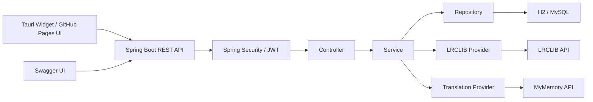
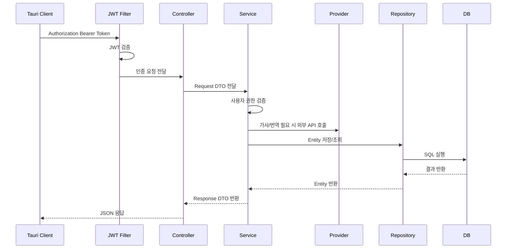
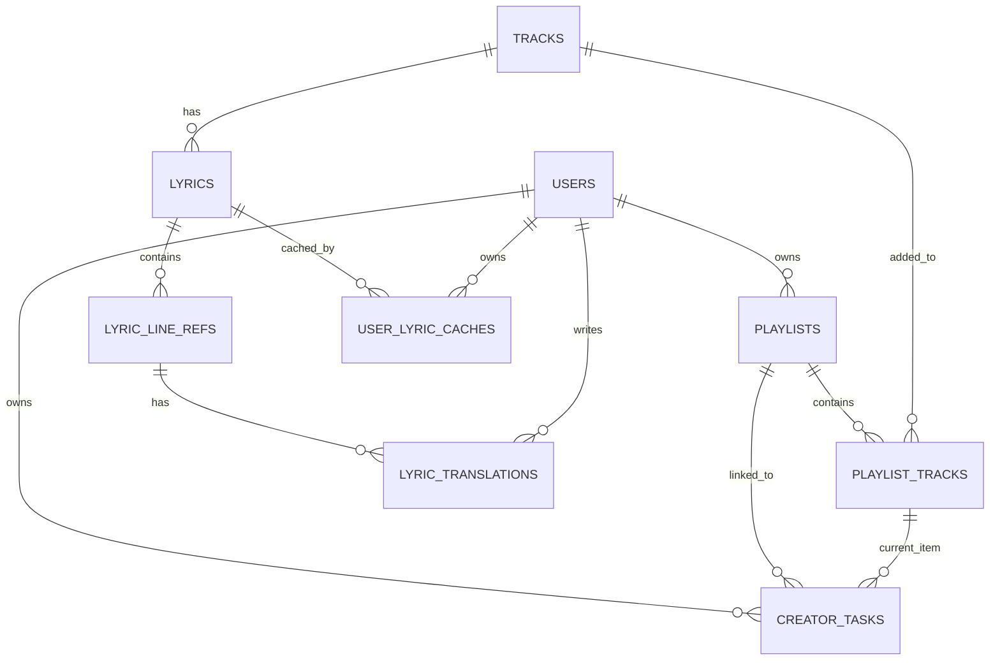

# Personal Project

> 미리 선정한 주제가 별도로 없다면 자바수업에서 만든 step19_GoodsOrderJDBC 프로젝트를 Spring Boot + Security + JPA + MySQL 기반으로 완성해보세요.

# KuroStep v1 Report

## 1. 프로젝트 개요

### 프로젝트 소개

KuroStep은 재택으로 작업하는 웹툰 작가, 일러스트레이터, 프리랜서 창작자가 오늘 할 작업과 작업용 BGM, 가사 라인, 한국어 번역 메모를 하나의 작업 맥락으로 관리하는 개인 작업 보조 서비스이다.

단순 Todo 앱이나 음악 앱이 아니라 `작업 카드 - 작업용 곡 - 플레이리스트 - 가사 라인 - 번역 메모`를 연결해, 창작자가 작업 중 듣는 음악과 가사 메모까지 함께 정리할 수 있게 하는 것이 핵심이다.

### 프로젝트 목표

- Spring Boot 기반 REST API로 회원, 작업 카드, 곡, 플레이리스트, 가사, 번역 메모 기능을 구현한다.
- Spring Security, JWT, BCrypt를 적용해 사용자 인증과 사용자별 데이터 접근 권한을 검증한다.
- JPA 연관관계를 사용해 작업 카드와 플레이리스트, 곡, 현재 재생 항목을 연결한다.
- LRCLIB와 번역 Provider를 연동해 가사 조회와 한국어 번역 초안 생성 흐름을 만든다.
- Swagger, 테스트, Docker, EC2 배포를 통해 백엔드 세미 프로젝트로 보고 가능한 결과물을 만든다.
- Tauri 기반 최소 위젯을 연결해 실제 사용 흐름을 시연한다.

### 주요 기능

- 회원가입, 로그인, JWT 인증
- 사용자별 작업 카드 CRUD
- 작업 상태 변경: `TODO`, `DOING`, `DONE`
- 곡 등록, 검색, 상세 조회
- YouTube URL 기반 곡 정보 저장
- 플레이리스트 생성, 수정, 삭제
- 플레이리스트에 곡 추가, 제거, 순서 변경
- 작업 카드에 플레이리스트 연결
- 작업 카드의 현재 재생 곡 항목 설정
- LRCLIB 기반 가사 조회
- 가사 라인 참조 생성 및 조회
- MyMemory 기반 한국어 번역 초안 생성
- 라인별 번역 메모 저장, 수정, 삭제
- Tauri 위젯에서 로그인, 플레이어, 작업/가사 메모, 가사 오버레이 표시
- Swagger API 문서화
- Docker 기반 실행 환경 구성
- Terraform 기반 AWS EC2 배포

## 2. 요구사항 분석

### 기능 요구사항

| 구분 | 요구사항 |
|---|---|
| 회원 | 사용자는 이메일, 비밀번호, 닉네임으로 회원가입할 수 있다. |
| 인증 | 사용자는 로그인 후 JWT Access Token을 발급받을 수 있다. |
| 인가 | 사용자는 본인의 작업 카드, 플레이리스트, 번역 메모만 관리할 수 있다. |
| 작업 카드 | 사용자는 오늘 할 작업을 등록, 조회, 수정, 삭제할 수 있다. |
| 상태 변경 | 사용자는 작업 상태를 `TODO`, `DOING`, `DONE`으로 변경할 수 있다. |
| 곡 | 사용자는 작업 중 들을 곡 정보를 등록하고 검색할 수 있다. |
| 플레이리스트 | 사용자는 작업용 플레이리스트를 생성, 수정, 삭제할 수 있다. |
| 플레이리스트 곡 | 사용자는 플레이리스트에 곡을 추가, 제거하고 순서를 변경할 수 있다. |
| 작업 연결 | 사용자는 작업 카드에 플레이리스트를 연결할 수 있다. |
| 현재 곡 | 사용자는 작업 카드의 현재 재생 플레이리스트 항목을 설정할 수 있다. |
| 가사 | 사용자는 LRCLIB에서 조회한 가사 라인을 확인할 수 있다. |
| 번역 | 사용자는 가사 라인별 한국어 번역 초안을 생성할 수 있다. |
| 번역 메모 | 사용자는 번역문과 개인 메모를 저장, 수정, 삭제할 수 있다. |
| 위젯 | 사용자는 Tauri 위젯에서 작업, 플레이어, 가사 오버레이를 확인할 수 있다. |

### 비기능 요구사항

| 구분 | 요구사항 |
|---|---|
| 보안 | 비밀번호는 BCrypt로 암호화한다. |
| 인증 | JWT 토큰을 사용해 API 요청 사용자를 식별한다. |
| 권한 | 서비스 계층에서 사용자별 리소스 소유권을 검증한다. |
| 검증 | DTO와 Bean Validation으로 입력값을 검증한다. |
| 예외 처리 | 공통 예외 응답 형식을 사용한다. |
| 외부 연동 | 가사 조회와 번역 기능은 Provider 구조로 분리한다. |
| 데이터 저장 | 서버는 가사 전문을 대량 저장하지 않고, 라인 메타데이터와 번역 메모를 중심으로 저장한다. |
| 성능 | 가사 조회와 번역은 재생 흐름을 막지 않도록 로컬 캐시와 백그라운드 준비 전략을 사용한다. |
| 문서화 | Swagger UI로 API 명세를 확인할 수 있다. |
| 배포 | Docker와 AWS EC2에서 API 실행을 확인한다. |

## 3. 기술 스택

### Backend

- Java 21
- Spring Boot 4
- Spring MVC
- Spring Data JPA
- Bean Validation
- Lombok

### Database

- H2 Database: 로컬 개발 및 테스트
- MySQL: 운영/배포 환경
- JPA Entity Relationship

### Security

- Spring Security
- JWT
- BCrypt
- CORS 설정

### DevOps

- Gradle
- Swagger / springdoc-openapi
- Docker / Docker Compose
- Terraform
- GitHub Actions
- AWS EC2
- GitHub Pages
- Tauri

## 4. 시스템 아키텍처

### 시스템 구성도



### 요청 흐름도



## 5. 데이터베이스 설계

### ERD



### 테이블 정의

| 테이블 | 설명 | 주요 컬럼 |
|---|---|---|
| `users` | 사용자 계정 정보 | `id`, `email`, `password`, `nickname`, `role` |
| `creator_tasks` | 사용자의 작업 카드 | `id`, `user_id`, `playlist_id`, `current_playlist_track_id`, `title`, `status`, `task_date` |
| `playlists` | 사용자별 작업용 플레이리스트 | `id`, `user_id`, `name`, `description` |
| `playlist_tracks` | 플레이리스트에 담긴 곡과 순서 | `id`, `playlist_id`, `track_id`, `sort_order` |
| `tracks` | 곡 정보와 외부 재생 소스 | `id`, `title`, `artist`, `source_type`, `source_url`, `source_id` |
| `lyrics` | 가사 묶음 메타데이터 | `id`, `track_id`, `provider`, `language_code`, `synced` |
| `user_lyric_caches` | 사용자별 로컬 가사 캐시 상태 | `id`, `user_id`, `lyric_id`, `local_cache_key`, `cache_status` |
| `lyric_line_refs` | 가사 라인 참조 정보 | `id`, `lyric_id`, `line_index`, `start_time_ms`, `text_hash` |
| `lyric_translations` | 사용자별 번역문과 메모 | `id`, `lyric_line_ref_id`, `user_id`, `language_code`, `translated_text`, `memo_text` |

가사 저장 정책은 다음과 같다.

- 서버 DB는 가사 전문을 대량 보관하지 않는다.
- 서버는 가사 묶음, 라인 번호, 시작 시간, 해시 등 연결용 메타데이터를 저장한다.
- 번역문과 개인 메모는 사용자별 데이터로 저장한다.
- 클라이언트는 조회된 가사를 로컬 캐시로 저장하고, 같은 곡 재생 시 우선 사용한다.

## 6. API 설계

### REST API 명세

| Method | URL | 설명 | 인증 |
|---|---|---|---|
| POST | `/api/auth/signup` | 회원가입 | X |
| POST | `/api/auth/login` | 로그인 | X |
| GET | `/api/auth/me` | 내 인증 정보 조회 | O |
| GET | `/api/tasks/today` | 오늘 작업 조회 | O |
| GET | `/api/tasks` | 날짜별 작업 목록 조회 | O |
| POST | `/api/tasks` | 작업 카드 생성 | O |
| GET | `/api/tasks/{taskId}` | 작업 상세 조회 | O |
| PATCH | `/api/tasks/{taskId}` | 작업 수정 | O |
| DELETE | `/api/tasks/{taskId}` | 작업 삭제 | O |
| PATCH | `/api/tasks/{taskId}/status` | 작업 상태 변경 | O |
| PATCH | `/api/tasks/{taskId}/playlist/{playlistId}` | 작업에 플레이리스트 연결 | O |
| PATCH | `/api/tasks/{taskId}/current-playlist-track/{playlistTrackId}` | 현재 곡 항목 설정 | O |
| GET | `/api/playlists` | 플레이리스트 목록 조회 | O |
| POST | `/api/playlists` | 플레이리스트 생성 | O |
| GET | `/api/playlists/{playlistId}` | 플레이리스트 상세 조회 | O |
| PATCH | `/api/playlists/{playlistId}` | 플레이리스트 수정 | O |
| DELETE | `/api/playlists/{playlistId}` | 플레이리스트 삭제 | O |
| GET | `/api/playlists/{playlistId}/tracks` | 플레이리스트 곡 목록 조회 | O |
| POST | `/api/playlists/{playlistId}/tracks/{trackId}` | 플레이리스트에 곡 추가 | O |
| DELETE | `/api/playlists/{playlistId}/tracks/{trackId}` | 플레이리스트에서 곡 제거 | O |
| PATCH | `/api/playlists/{playlistId}/tracks/reorder` | 플레이리스트 곡 순서 변경 | O |
| POST | `/api/tracks` | 곡 등록 | O |
| GET | `/api/tracks/search` | 곡 검색 | O |
| GET | `/api/tracks/{trackId}` | 곡 상세 조회 | O |
| POST | `/api/tracks/youtube-playlist/preview` | YouTube playlist 미리보기 | O |
| POST | `/api/tracks/{trackId}/lyrics/fetch` | LRCLIB 가사 조회 | O |
| GET | `/api/tracks/{trackId}/lyrics` | 곡의 가사 메타데이터 조회 | O |
| GET | `/api/lyrics/{lyricId}` | 가사 상세 조회 | O |
| POST | `/api/lyric-line-refs/{lineRefId}/translations/auto-draft` | 번역 초안 생성 | O |
| POST | `/api/lyric-line-refs/{lineRefId}/translations` | 번역 메모 저장 | O |
| GET | `/api/lyric-line-refs/{lineRefId}/translations` | 번역 메모 조회 | O |
| DELETE | `/api/lyric-line-refs/{lineRefId}/translations` | 번역 메모 삭제 | O |

### API 규칙

- 요청과 응답은 DTO를 사용한다.
- 인증이 필요한 API는 `Authorization: Bearer {token}` 형식을 사용한다.
- 입력값 검증 실패 시 `400 Bad Request`를 반환한다.
- 인증 실패 시 `401 Unauthorized`를 반환한다.
- 리소스 소유자가 아닌 사용자의 접근은 `403 Forbidden`으로 처리한다.
- 존재하지 않는 리소스는 `404 Not Found`로 처리한다.
- 외부 Provider 호출 실패는 사용자에게 안내 가능한 예외로 변환한다.

## 7. 프로젝트 구조

### 패키지 구조

```text
com.kurostep
 ├── auth
 │   ├── controller
 │   ├── dto
 │   └── service
 ├── user
 │   ├── domain
 │   └── repository
 ├── task
 │   ├── controller
 │   ├── domain
 │   ├── dto
 │   ├── repository
 │   └── service
 ├── playlist
 │   ├── controller
 │   ├── domain
 │   ├── dto
 │   ├── repository
 │   └── service
 ├── track
 │   ├── controller
 │   ├── domain
 │   ├── dto
 │   ├── repository
 │   └── service
 ├── lyric
 │   ├── controller
 │   ├── domain
 │   ├── dto
 │   ├── provider
 │   ├── repository
 │   └── service
 ├── translation
 │   ├── controller
 │   ├── domain
 │   ├── dto
 │   ├── provider
 │   ├── repository
 │   └── service
 ├── security
 │   ├── config
 │   └── jwt
 └── common
     ├── domain
     ├── exception
     └── response
```

### 계층 구조(Controller / Service / Repository)

| 계층 | 역할 |
|---|---|
| Controller | HTTP 요청 수신, DTO 검증, 응답 반환 |
| Service | 비즈니스 로직, 트랜잭션, 권한 검증 |
| Repository | Spring Data JPA 기반 데이터 접근 |
| Domain | Entity와 Enum 정의 |
| DTO | 요청/응답 데이터 전달 |
| Provider | LRCLIB, 번역 API 등 외부 연동 추상화 |

## 8. 회원 인증 및 인가

### 회원가입

- 이메일, 비밀번호, 닉네임을 입력받는다.
- 이메일 중복 여부를 검증한다.
- 비밀번호는 BCrypt로 암호화한다.
- 기본 권한은 `ROLE_USER`로 저장한다.

### 로그인

- 이메일과 비밀번호를 검증한다.
- 인증 성공 시 JWT Access Token을 발급한다.
- 클라이언트는 이후 요청마다 Authorization 헤더에 토큰을 담아 보낸다.

### JWT 인증

- JWT 필터에서 Authorization 헤더의 토큰을 추출한다.
- 토큰 유효성을 검증한다.
- 토큰의 사용자 id를 기반으로 인증 객체를 생성한다.
- 인증 객체를 SecurityContext에 저장한다.

### 권한 처리(Spring Security)

- 회원가입, 로그인, Swagger 등 일부 경로는 인증 없이 접근할 수 있다.
- `/api/**` 주요 API는 인증이 필요하다.
- 작업 카드, 플레이리스트, 번역 메모는 서비스 계층에서 소유자 검증을 수행한다.
- 다른 사용자의 리소스 접근은 예외로 차단한다.

## 9. 핵심 비즈니스 기능 구현

### CRUD 기능

- 작업 카드 CRUD
- 플레이리스트 CRUD
- 플레이리스트 곡 추가, 제거, 순서 변경
- 곡 등록 및 조회
- 번역 메모 저장, 수정, 삭제

### 검색 기능(선택)

- 곡 제목 또는 아티스트명 기준 검색을 제공한다.
- YouTube `sourceId`가 있는 경우 기존 곡 중복 등록을 줄이기 위해 `sourceType + sourceId` 기준 조회를 사용한다.

### 페이징 처리

- 백엔드 MVP는 빠른 검증을 위해 List 기반 응답을 사용했다.
- 프론트 위젯에서는 플레이리스트 곡을 10개 단위로 나누어 표시한다.
- 후속 개선에서는 작업 목록, 곡 검색, 플레이리스트 곡 목록에 `Pageable`을 적용한다.

## 10. JPA 활용

### 엔티티 설계

- `User`
- `CreatorTask`
- `Playlist`
- `PlaylistTrack`
- `Track`
- `Lyric`
- `UserLyricCache`
- `LyricLineRef`
- `LyricTranslation`

### 연관관계 매핑

| 관계 | 매핑 |
|---|---|
| User - CreatorTask | 1:N |
| User - Playlist | 1:N |
| Playlist - PlaylistTrack | 1:N |
| Track - PlaylistTrack | 1:N |
| Playlist - CreatorTask | 1:N |
| PlaylistTrack - CreatorTask | 1:N, 현재 재생 항목 참조 |
| Track - Lyric | 1:N |
| User - UserLyricCache | 1:N |
| Lyric - UserLyricCache | 1:N |
| Lyric - LyricLineRef | 1:N |
| LyricLineRef - LyricTranslation | 1:N |
| User - LyricTranslation | 1:N |

### Lazy Loading

- 연관관계는 기본적으로 `LAZY` 전략을 사용한다.
- Entity를 API 응답으로 직접 반환하지 않고 Response DTO로 변환한다.
- 트랜잭션 안에서 필요한 연관 데이터를 조회하고, Controller로는 DTO만 반환한다.

### Query Method

- `findByEmail`
- `existsByEmail`
- `findByUserId`
- `findByUserIdAndTaskDate`
- `findByPlaylistIdOrderBySortOrderAsc`
- `existsByPlaylistIdAndTrackId`
- `findByPlaylistIdAndTrackId`
- `findTopByPlaylistIdOrderBySortOrderDesc`
- `findByTitleContainingIgnoreCaseOrArtistContainingIgnoreCase`
- `findBySourceTypeAndSourceId`
- `findByTrackId`
- `findByUserIdAndLyricId`
- `findByLyricIdOrderByLineIndexAsc`
- `findByLyricLineRefIdAndUserId`

## 11. 테스트

### 단위 테스트

- 회원가입 성공 테스트
- 이메일 중복 가입 실패 테스트
- 로그인 성공/실패 테스트
- 곡 등록 및 검색 테스트
- 플레이리스트 생성 및 곡 추가 테스트
- 작업 카드 생성 및 상태 변경 테스트

### API 테스트

`KuroStepFlowIntegrationTest`와 실제 HTTP 요청으로 아래 흐름을 검증했다.

```text
회원가입
-> 로그인
-> JWT 인증
-> YouTube URL 곡 등록
-> 플레이리스트 생성
-> 플레이리스트에 곡 추가
-> 작업 카드 생성
-> 작업 카드에 플레이리스트 연결
-> 현재 곡 설정
-> 작업 상태 변경
-> LRCLIB 가사 조회
-> 가사 라인 참조 생성
-> MyMemory 번역 초안 생성
```

실제 검증 로그 예시는 다음과 같다.

```text
track 1 https://www.youtube.com/watch?v=dQw4w9WgXcQ
lyric 1 lines 58 hasSourceText true
draft 1 MYMEMORY AUTO_DRAFT 절대 포기하지 않을 거예요
```

## 12. API 문서화

### Swagger(OpenAPI)

Swagger/OpenAPI 문서화를 위해 `springdoc-openapi-starter-webmvc-ui`를 적용했다.

- 로컬 Swagger UI: `http://localhost:8080/swagger-ui/index.html`
- EC2 Swagger UI: `https://54-116-185-226.sslip.io/swagger-ui/index.html`
- OpenAPI JSON: `https://54-116-185-226.sslip.io/v3/api-docs`

Swagger는 메인 화면이 아니라 API 명세 확인과 개발 검증 보조 도구로 사용했다.

## 13. Docker 적용

### Dockerfile 작성

| 파일 | 역할 |
|---|---|
| `KuroStep/Dockerfile` | 로컬 실행용 Spring Boot 이미지 |
| `KuroStep/Dockerfile.prod` | EC2 배포용 jar 실행 이미지 |
| `KuroStep/docker-compose.yml` | 로컬 개발용 컨테이너 실행 |
| `KuroStep/docker-compose.prod.yml` | EC2 배포용 API + MySQL 실행 |
| `KuroStep/.env.prod.example` | 운영 환경변수 예시 |

### 컨테이너 실행

- 로컬 개발에서는 H2 DB로 빠르게 기능을 확인했다.
- EC2 배포에서는 MySQL 컨테이너와 Spring Boot API 컨테이너를 함께 실행했다.
- 운영 DB 비밀번호와 JWT secret은 코드에 직접 저장하지 않고 환경변수로 주입한다.

## 14. 배포

### AWS EC2 배포

Terraform으로 EC2 인프라를 구성했다.

| 파일 | 역할 |
|---|---|
| `infra/versions.tf` | Terraform 및 Provider 버전 |
| `infra/variables.tf` | 리전, 인스턴스 타입, SSH 대역 변수 |
| `infra/main.tf` | EC2, 보안그룹, Key Pair, Elastic IP |
| `infra/outputs.tf` | public IP, API URL, SSH 명령 출력 |
| `infra/user-data.sh` | Docker 설치 스크립트 |

### 서비스 실행 확인

- GitHub Pages: `https://song991123.github.io/KuroStep/`
- EC2 API: `https://54-116-185-226.sslip.io`
- EC2 Swagger UI: `https://54-116-185-226.sslip.io/swagger-ui/index.html`

확인한 항목:

- Terraform으로 EC2, 보안그룹, Elastic IP 생성
- Docker Compose로 Spring Boot API와 MySQL 실행
- `/v3/api-docs` 응답 확인
- `/api/auth/login` 응답 확인
- 테스트 계정으로 작업/플레이리스트 조회 확인
- 트랙 생성 및 플레이리스트 추가 API 확인

## 15. 트러블슈팅

### 개발 중 발생한 문제

| 문제 | 원인 |
|---|---|
| Spring Security 적용 후 401 발생 | 기본 Security 설정이 모든 요청을 보호함 |
| 시간 컬럼 누락 | 일부 Entity가 공통 시간 Entity를 상속하지 않음 |
| Service 스텁 예외 발생 | Controller/Service 틀만 있고 비즈니스 로직이 미구현됨 |
| 다른 사용자 데이터 접근 위험 | 서비스 계층 소유자 검증 필요 |
| Lazy Loading 예외 가능성 | 트랜잭션 밖에서 연관 Entity 접근 가능 |
| Docker DB 연결 실패 | 컨테이너 내부에서 `localhost`를 DB 호스트로 사용 |
| YouTube iframe 재생 제한 | Tauri WebView origin과 YouTube iframe 정책 충돌 |
| GitHub Pages와 HTTP API 연결 문제 | HTTPS 페이지에서 HTTP API 호출 시 Mixed Content 발생 |
| 가사 조회로 인한 재생 지연 | 외부 Provider 호출이 재생 흐름을 막을 수 있음 |
| 링크 추가 버튼이 `불러오는 중`에서 멈춤 | 링크 위젯 재렌더 후 이벤트 바인딩 함수가 자기 자신을 재귀 호출함 |

### 해결 과정

- `SecurityConfig`에서 인증 제외 경로와 인증 필요 경로를 분리했다.
- 비밀번호는 BCrypt로 암호화하고, 로그인 성공 시 JWT를 발급하도록 구현했다.
- 작업, 플레이리스트, 번역 메모 수정 시 사용자 id와 리소스 소유자 id를 비교했다.
- Service 스텁을 Repository 기반 실제 저장/조회 로직으로 교체했다.
- DTO 변환을 통해 Entity 직접 반환을 피했다.
- Docker Compose에서 API 컨테이너가 MySQL 컨테이너 이름으로 DB에 접근하도록 구성했다.
- GitHub Pages와 EC2 API 연결을 위해 HTTPS 접근 주소를 사용했다.
- YouTube 재생은 다운로드나 광고 제거 없이 공식 IFrame Player API 기반으로만 처리했다.
- 가사 조회와 번역은 재생 흐름을 막지 않도록 로컬 캐시와 백그라운드 준비 전략을 사용했다.
- 트랙 추가 직후 여러 가사 fetch가 동시에 실행되지 않도록 1개씩 처리하는 큐를 적용했다.
- 링크 추가 버튼 멈춤 문제는 `bindLinkImportAction()`의 재귀 호출을 실제 이벤트 바인딩으로 수정해 해결했다.

## 16. 프로젝트 회고

### 배운 점

- Spring Boot에서 Controller, Service, Repository, Entity, DTO가 어떤 책임을 갖는지 실제로 확인했다.
- JPA 연관관계를 사용해 사용자, 작업 카드, 플레이리스트, 곡, 가사, 번역 메모를 연결했다.
- Spring Security와 JWT를 적용해 인증 흐름을 구성했다.
- 사용자별 권한 검증은 Controller가 아니라 Service 계층에서 처리하는 것이 중요하다는 점을 배웠다.
- 외부 API 연동은 Provider 구조로 분리해야 테스트와 확장이 쉬워진다는 점을 확인했다.
- Docker, Terraform, EC2 배포를 통해 로컬 개발과 배포 환경 차이를 경험했다.

### 개선할 점

- 현재 일부 도메인 API는 `userId` 요청 파라미터를 함께 사용하므로, 후속 개선에서 JWT 인증 사용자 정보 기반으로 완전히 교체해야 한다.
- 외부 Provider 실패 시 재시도, fallback, timeout 정책을 더 체계화해야 한다.
- 작업 목록, 곡 검색, 플레이리스트 곡 목록은 백엔드 `Pageable` 기반 페이징으로 개선할 필요가 있다.
- Tauri 위젯의 Vanilla JavaScript 상태 관리가 복잡해지면서 렌더링과 이벤트 바인딩 버그가 발생했다.
- 가사 로컬 캐시를 localStorage 수준이 아니라 Tauri 로컬 파일 저장소 기반으로 안정화해야 한다.
- EC2 리소스 비용 관리를 위해 시연 후 중지 또는 `terraform destroy` 절차를 정리해야 한다.

### 향후 확장 계획

- Tauri 프론트엔드를 Vanilla JavaScript에서 React + Vite 기반으로 재구현한다.
- React의 컴포넌트 구조와 상태 관리로 재렌더링 범위를 줄이고, 이벤트 바인딩 누락 문제를 개선한다.
- Next.js는 SSR과 라우팅이 필요한 웹 서비스 확장 단계에서 검토하고, 현재 Tauri 위젯 중심 구조에서는 React + Vite가 더 가볍고 적합하다.
- JWT 인증 사용자 정보를 기반으로 API의 `userId` 파라미터를 제거한다.
- Tauri 로컬 파일 저장소에 가사 캐시를 저장하고, 플레이리스트 삭제와 캐시 삭제 정책을 연결한다.
- 이메일 인증과 Google OAuth2 로그인을 추가한다.
- WebSocket 또는 이벤트 기반 구조로 현재 작업/재생 상태를 오버레이에 더 안정적으로 전달한다.
- 작업 시간 통계, 전역 단축키, 멀티 모니터 오버레이를 추가한다.
