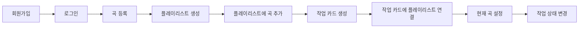
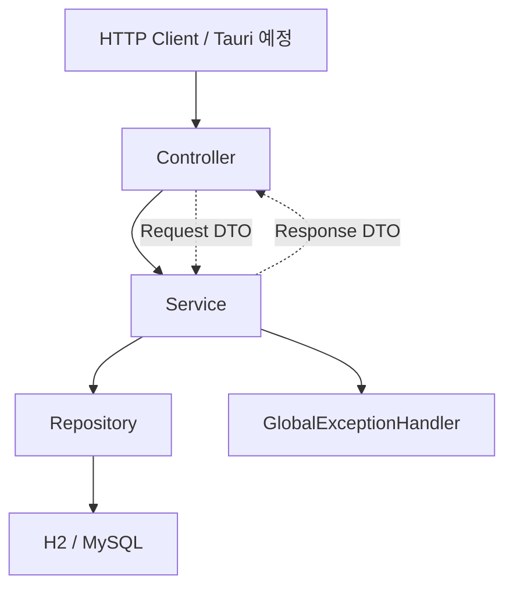
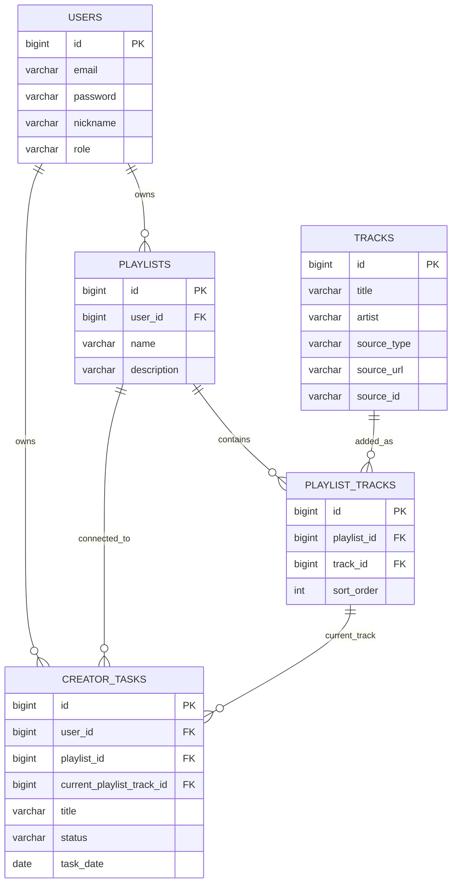

# KuroStep MVP Presentation Assets

## 1. MVP 진행 보드

| 완료 | 진행 중 | 트러블슈팅 | 내일 할 일 |
|---|---|---|---|
| Entity / Repository 구성 | 최종 보고서 정리 | Tauri YouTube iframe `Error 153` | 시연 순서 1회 리허설 |
| Auth/JWT 구현 | API 요청/응답 캡처 | YouTube 숨김 오디오 재생은 공식 임베드 흐름 아님 | 최종 테스트 재실행 |
| BCrypt 암호화/검증 | 발표 문장 다듬기 | Tauri 로컬 번들 origin 제약 | 보고서 최종 오탈자 확인 |
| Track 등록/검색 | API 요청/응답 캡처 |  |  |
| Playlist 생성/곡 추가 | 발표 문장 다듬기 |  |  |
| CreatorTask CRUD/상태 변경 |  |  |  |
| 작업-플레이리스트 연결 |  |  |  |
| 현재 플레이리스트 곡 설정 |  |  |  |
| LRCLIB 실제 API 연동 |  |  |  |
| MyMemory 번역 초안 생성 |  |  |  |
| Tauri 최소 위젯 API 연동 |  |  |  |
| Tauri 가사 오버레이 이벤트 연동 |  |  |  |
| 통합 테스트 통과 |  |  |  |
| 실제 HTTP 요청 검증 |  |  |  |
| Docker/EC2 배포 확인 |  |  |  |
| Swagger 외부 접속 확인 |  |  |  |

## 2. 핵심 플로우 다이어그램



## 3. 백엔드 구조도



## 4. MVP 간단 ERD



## 5. 보고용 검증 문장

이번 MVP는 seed 데이터를 미리 넣어 보여주는 방식이 아니라, 실제 API 요청으로 데이터를 생성하고 연결하는 흐름을 검증했다.

검증된 흐름:

```text
회원가입 -> 로그인 -> 실제 YouTube URL 곡 등록 -> 플레이리스트 생성
-> 플레이리스트에 곡 추가 -> 작업 카드 생성 -> 플레이리스트 연결
-> 현재 곡 설정 -> 작업 상태 변경
```

검증 방법:

- `./gradlew test --rerun-tasks`
- `KuroStepFlowIntegrationTest`
- `http/kurostep-demo.http`
- 실제 HTTP 요청으로 H2 DB 저장 확인
- EC2 배포 서버에서 Swagger UI와 Auth API 응답 확인

## 6. 발표에서 선을 그을 부분

이번 세미 MVP에서 실제 동작 또는 실제 검증으로 가져갈 것:

- 회원가입/로그인 최소 구현
- BCrypt 비밀번호 암호화
- 작업 카드 CRUD와 상태 변경
- 곡 등록/검색
- 플레이리스트 생성과 곡 추가
- 작업 카드와 플레이리스트 연결
- 현재 플레이리스트 곡 설정
- 공통 예외 응답
- 통합 테스트와 HTTP 요청 검증
- LRCLIB 실제 API 연동
- MyMemory 자동 번역 초안 생성
- Tauri 최소 위젯 API 연동
- Tauri 가사 오버레이 이벤트 연동
- Docker Compose 기반 EC2 배포
- Swagger/OpenAPI 외부 접속 확인

트러블슈팅으로 설명할 것:

- Tauri 로컬 번들 앱에서 YouTube iframe이 `tauri://localhost` origin으로 인식되어 `Error 153` 발생
- YouTube 숨김 오디오 재생/스트림 추출은 공식 임베드 흐름이 아니므로 사용하지 않음
- 앱 내부 재생을 유지하려면 HTTPS 프론트 배포 후 Tauri가 해당 URL을 로드하는 구조를 추가 검토
- `t3.micro`에서 Spring Boot + MySQL 동시 실행이 불안정해 `t3.small`로 조정
- GitHub Pages에서 EC2 HTTP API를 직접 호출하려면 HTTPS 설정이 필요함

남은 검증:

- Tauri 위젯/가사 오버레이 최종 시연 확인
- 발표 전 EC2 서버 상태와 비용 정리 확인
